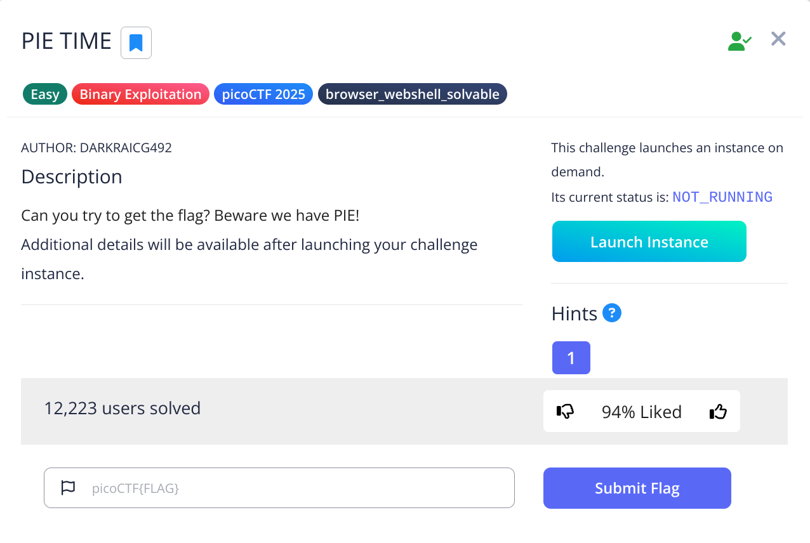
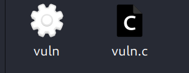
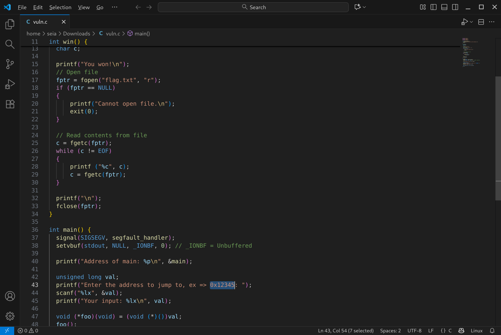
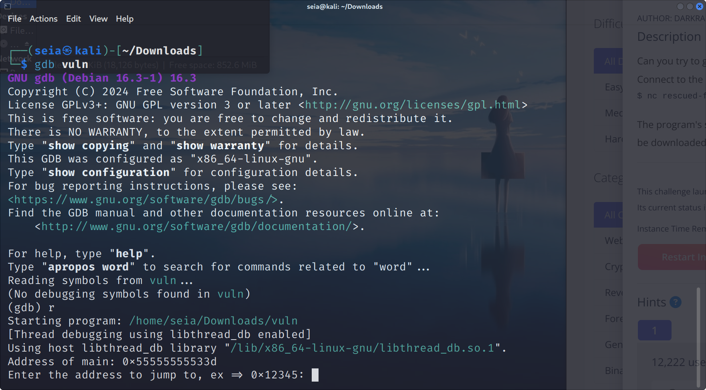
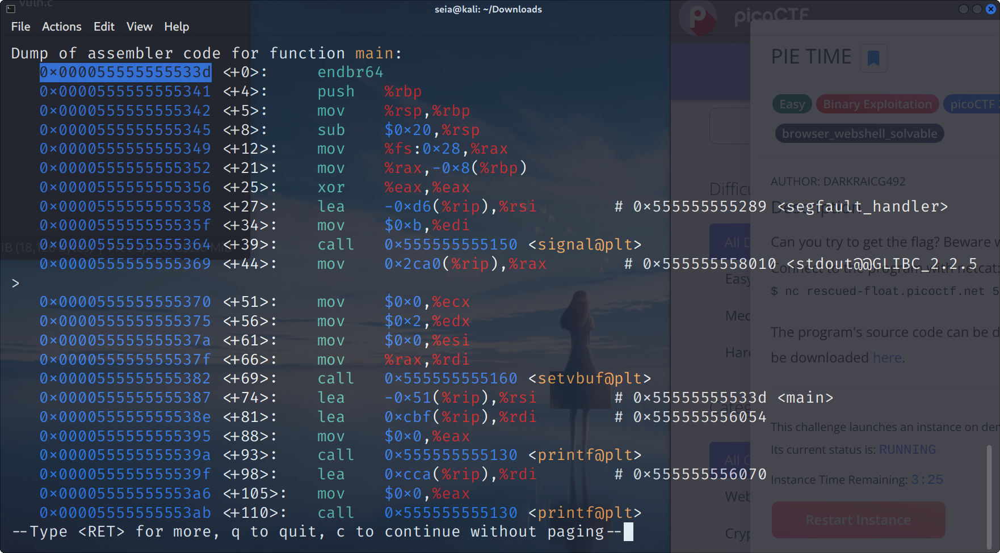
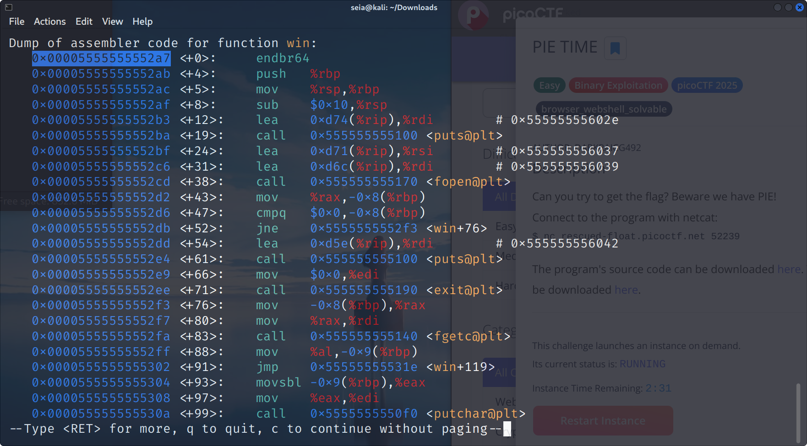
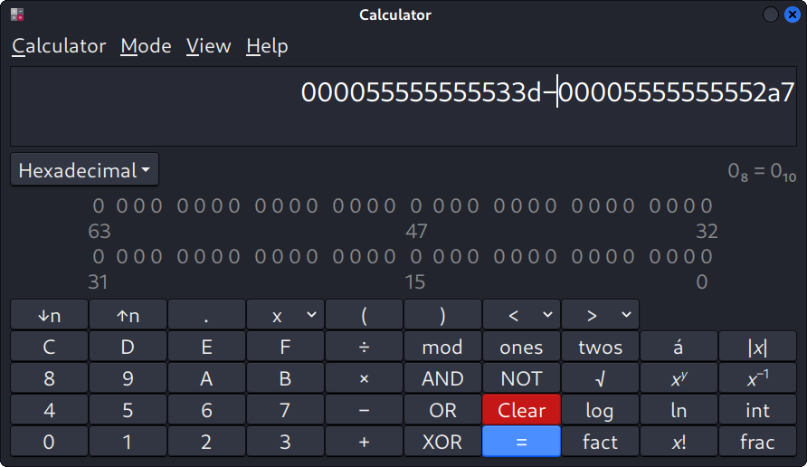
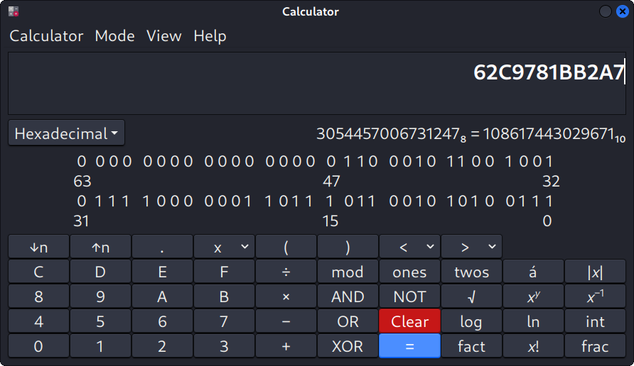
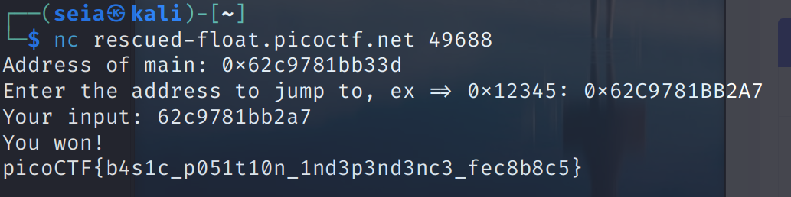

## Today we doing the Binary Exploitation
### this question is form the picoctf

[picoCTF:](https://play.picoctf.org/practice)



<br>

When we start do the question. We have to download two files.
<br>



<br>

I open the vuln.c I saw some code, I think that's the question and we have to find the goal.
<br>



<br>

This code contains a memory leak. so our goal is to Find the memory address of the win!

<br>

and here we need a tool *GDB*!<br>
*GDB* is Assist developers in inspecting memory, controlling execution state, and locating and fixing errors during program execution.

<br>
*GDB* can help us to see the binary code.

<br>



<br>

so we run it, and I realize it they are similar. Then we can Easily to find the address.

<br>

```bash
disass main

```



<br>

we write down the address, Becuase we need to know how far the address with win, so we both need to know where is the win function address

<br>



<br>

after we get the win function address we using the calculator the get the number that how far with main

<br>



<br>

then we got *96* !
<br>
we have to back to the Terminal and get the main address(Because main address will change) and do Subtraction again. (main_address - 96 = answer)
<br>



<br>
we add the 0x.and<br>

we did it!!




