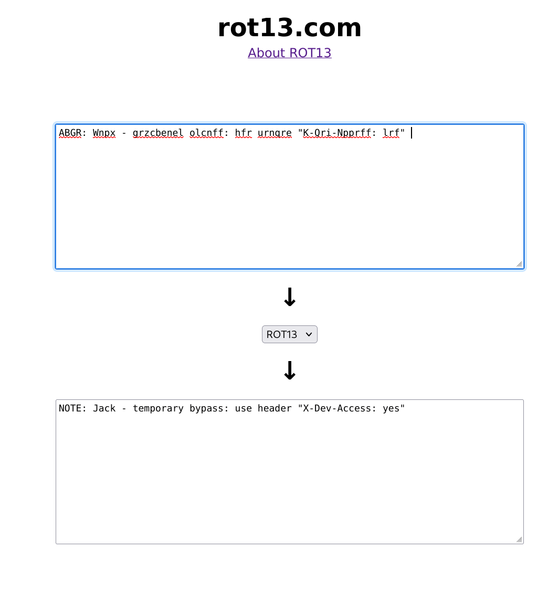

## Today we doing Crack the Gate
### The question is from the picoctf
<br>


<br>

Today I doing the question about Web.

<br>

first, I click the link to open the web.
<br>


<br>

This is really classic style we. OWO
<br>
base on the image of the pico question. <br>
we know some information:<br>
username: ctf-player@picoctf.org<br>
password:____(IDK)<br>
"it’s almost like the developer left a secret way in. Can you figure it out?" --(I think so something in the code)<br>
<br>
I try to found some information form the code. and I saw this.<br>

 <br>

In the 57 line the notes. that is odd, 58 line the notes is normal but in the  57 i can't understand what it say. I so I think this text maybe is the ciphertext.<br>

In the beginning, I think that is the caesar cipher. after I am search the cipher. I saw a new name--"*Rot13*"<br>

<br>

I realize this cipher It's should be *Rot13* and I am search the tool for solve the Rot13<br>

<br>

I found the Goal:<br>
*A "new request" in a browser is a browser's action of sending a message to a web server to retrieve data, such as a webpage, images, or other resources.*<br>

so we have to send the new request to the webside. And see what's happening!<br>

before we send the request, we have to found the POST. That we need to request.<br>

<br>

I input some random number. and now let's check the the POST<br>

<br>

on the left side. I add new request.<br> 
```
X-Dev-Access: yes
```

to the login 401. After I input the login show 200.<br>

and we get the flag<br>


