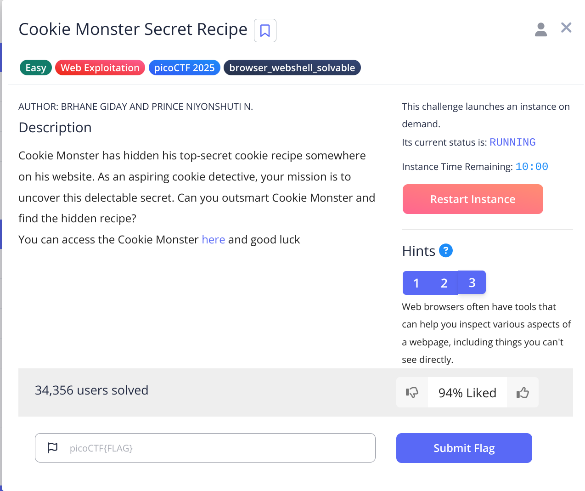
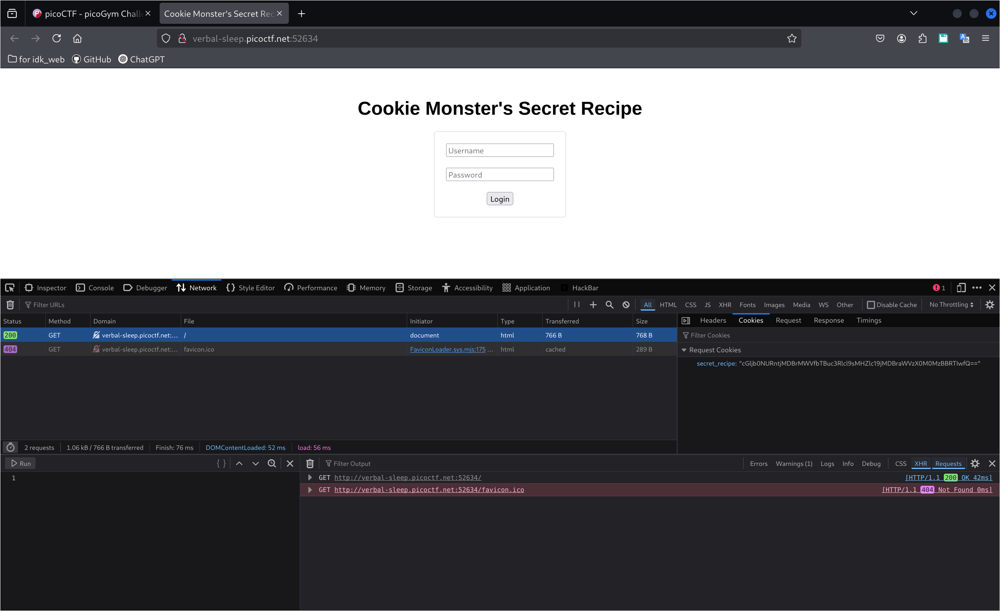
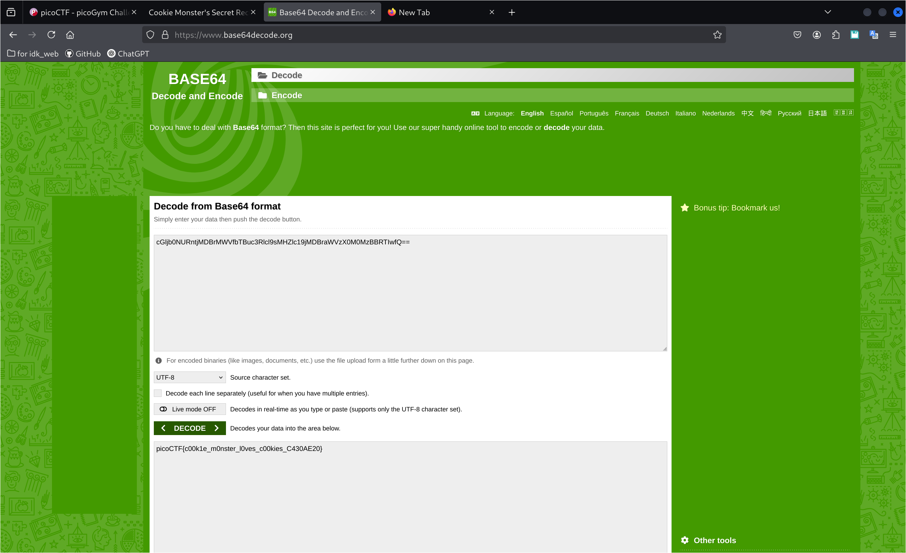

## today we doing the Cookie Monster Secret Recipe
### The question is form picoCtf

 

This is really easy, So when I start I think the answer is about the cookie. 

*about cookie*: cookie is the data save on the web, the web side can use cookie to know who you are, and show what you need. 

I open the Network and saw the cookie.  
But we don't know what is the flag. 
back to our talk, the cookie is the data, they maybe is like:  
*user:blabalbal* 

so I think this is encode, so that's why we don't understand 

If this is cipher, I think it's probably is the base64,Because we can see the number(67), small latter(a), capital letter(A) and some special symbols(=) 

 

and we found the flag :D!