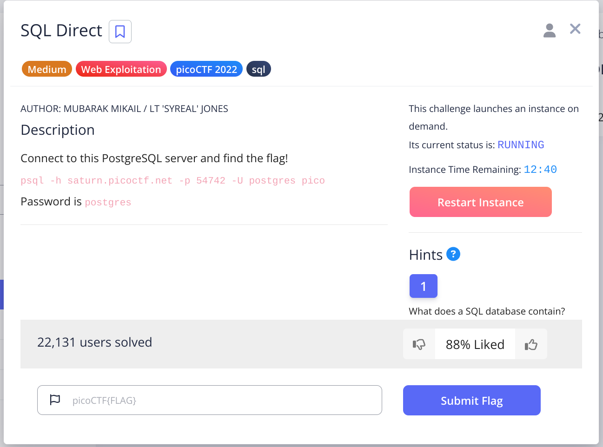
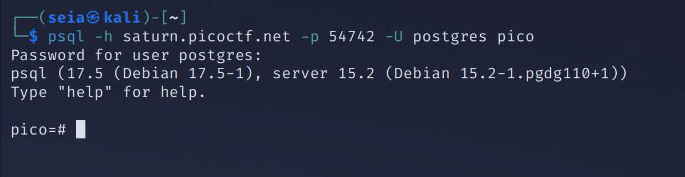
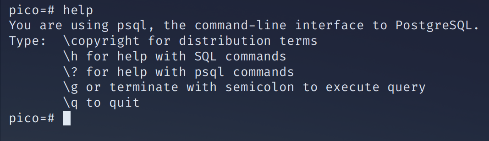
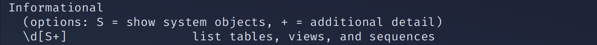
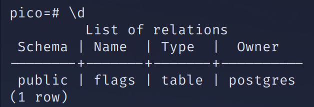
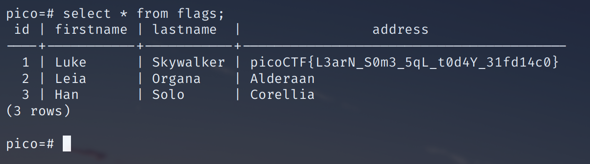

## question is From picoctf
 

 
first, I use the command to open our qz.:D
 

 
when I into here, I don't know how to do. So I am input help 
 

 

because this question is about the qsql so I input /?
 

 

we remenber this command and try it.
 

 

It's flag!!, the question is about the sql so that's how I write 

'''
select * from flags;
'''
 

 
wohu!