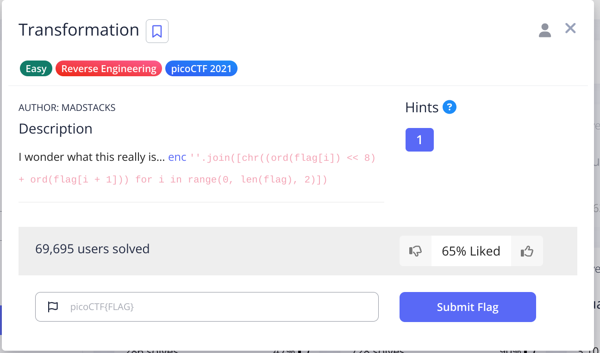
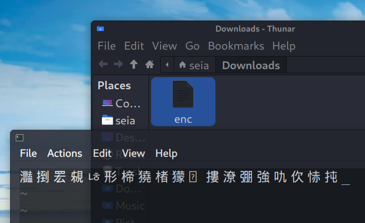
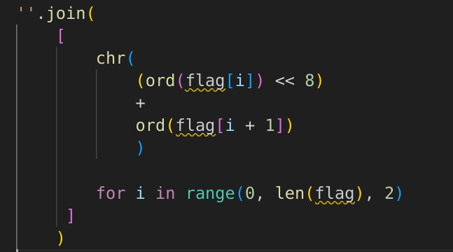
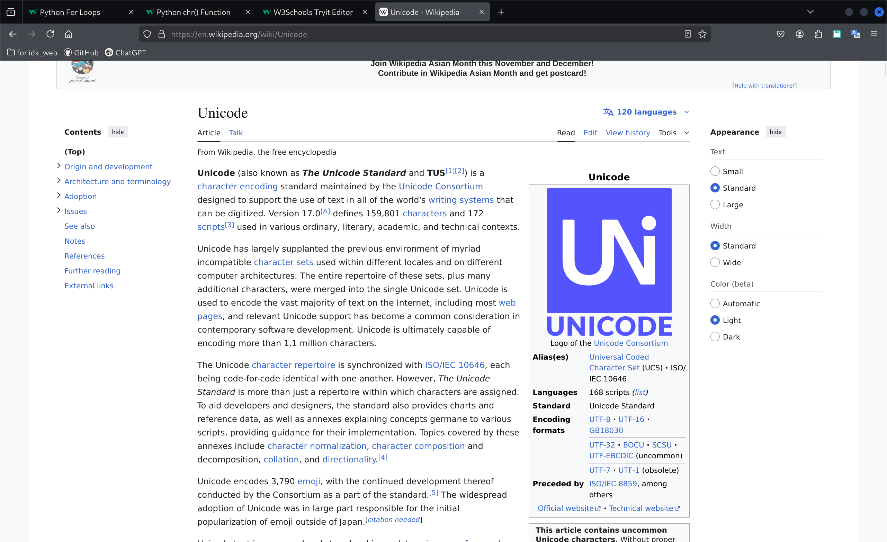
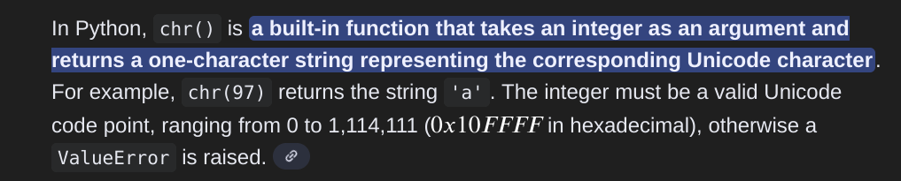
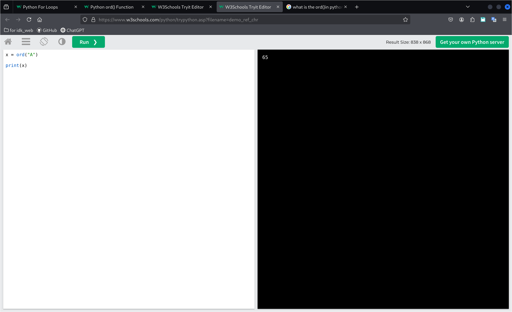
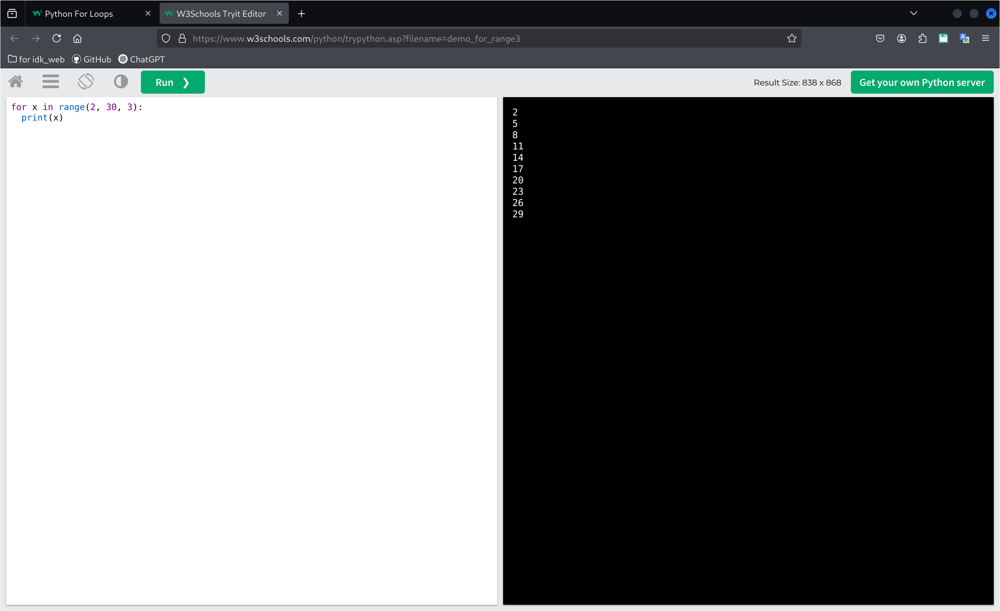
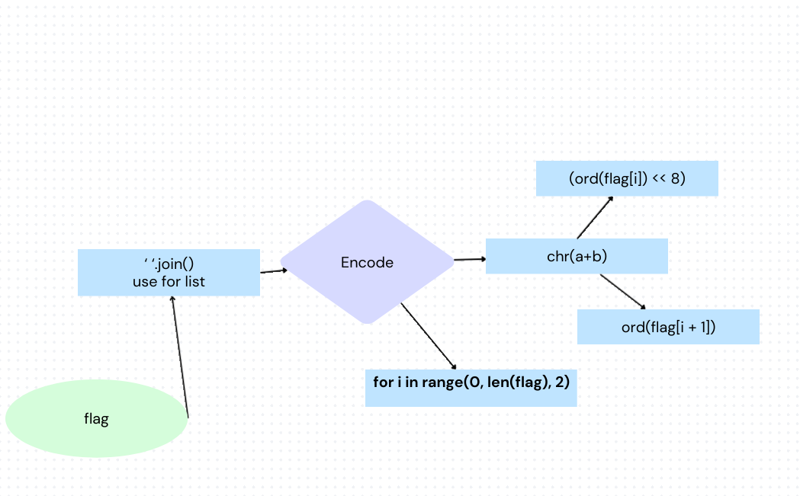

## today we doing the Transformation
### The question is form picoCtf

 

first I saw the menu have the code and a file 

 
when I downloads the enc file, I open it and saw some random text.So I was think this is a ciphertext 
but let's figit out what means the code  

 
It's have two part for bulid the ciphertext and the **for** I think It's use for the make hold flag. 
before that I go to learn some things. 

 

This is made of canva I use this to think about how to write the code 

 

 

about the code
i make encode string for save the cipher. 

first we get the unicode 
and reverse function is use for solve the "chrs" 
char one is hight byte so we need to move to 8 
and chr two is the low byte I search about it and found the answer that is add *& 0xFF* 
 
after that i make the for loop to bulid full sentence. 
print out the flag

