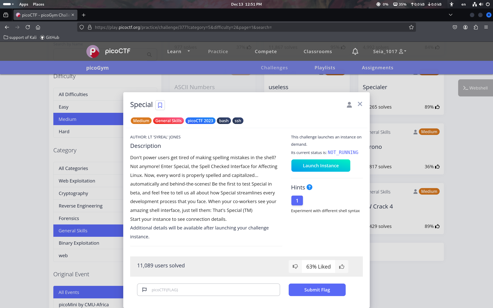
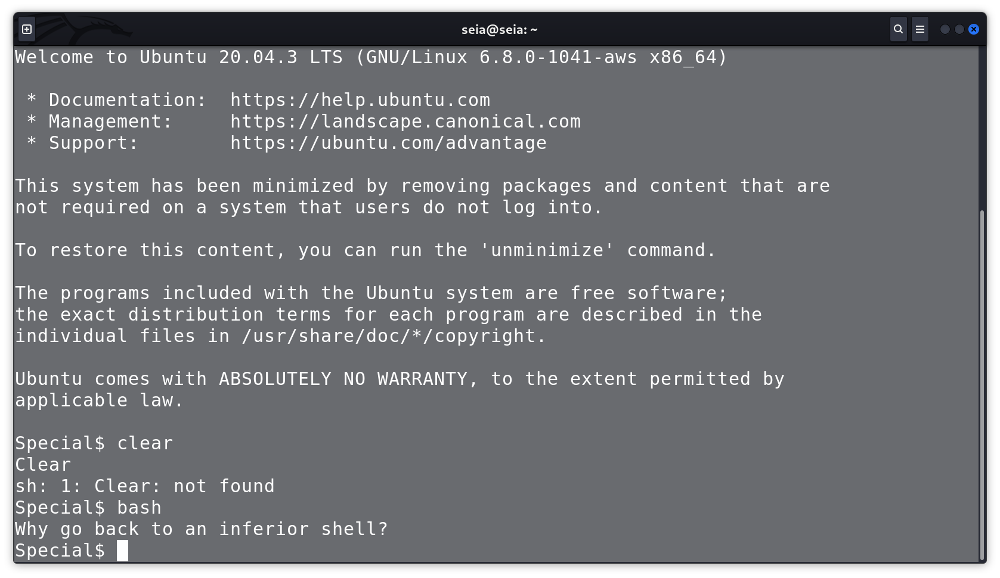
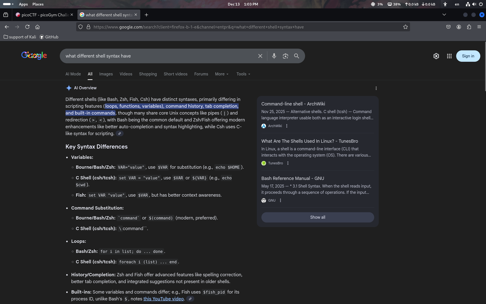
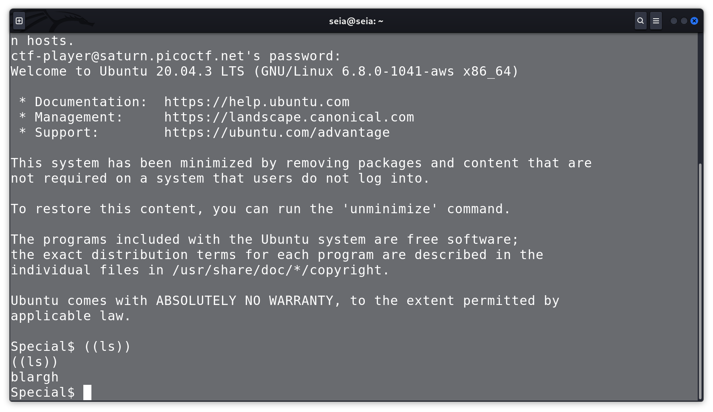
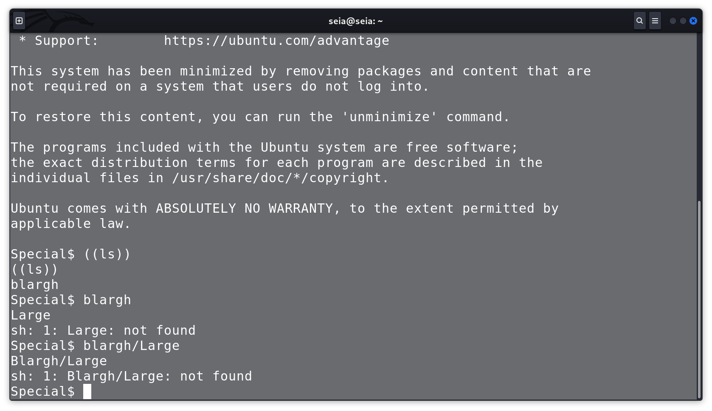
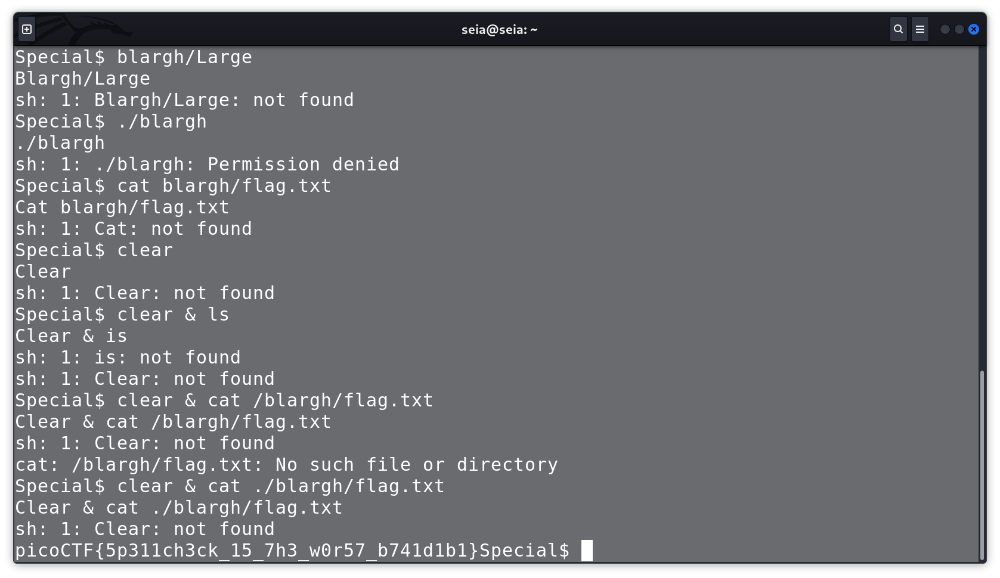

## picoctf

 
wow, let's get go. 

 
I see the 'special bash' I can't input the normal command. 

 
Before, we do the qz, I go search Information about the bashsynax. 

 
after I try many times,I found the key word, the *blargh* i think It's like the foulder to save some thing. 

 
The *large* is northing. 

 
after, I try many time and found some help, I found the flag. 