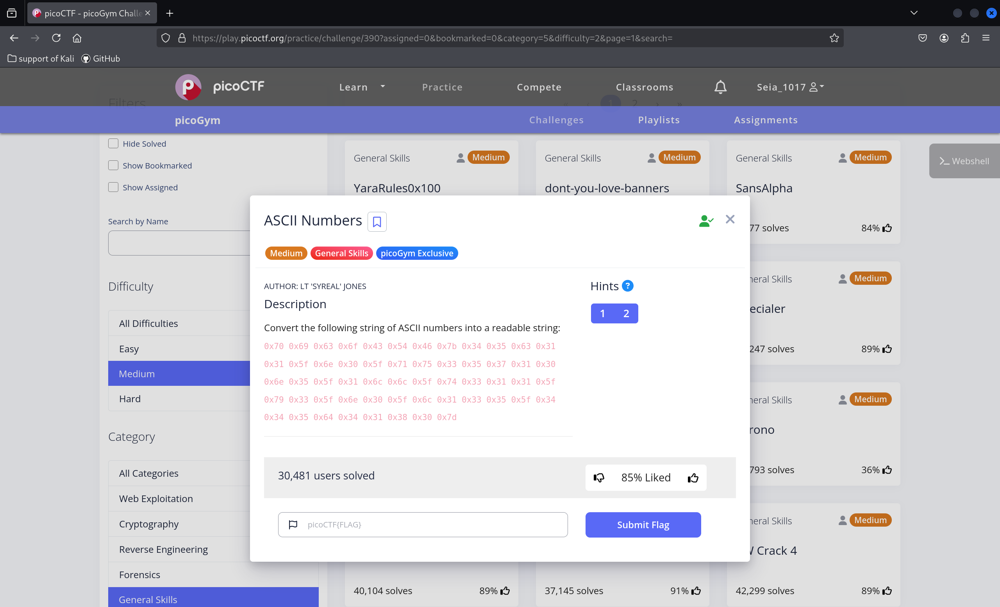
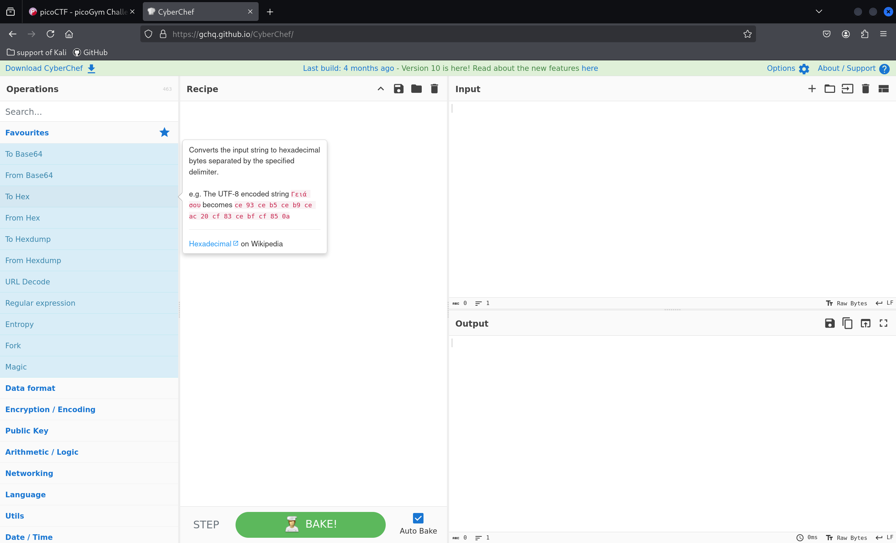
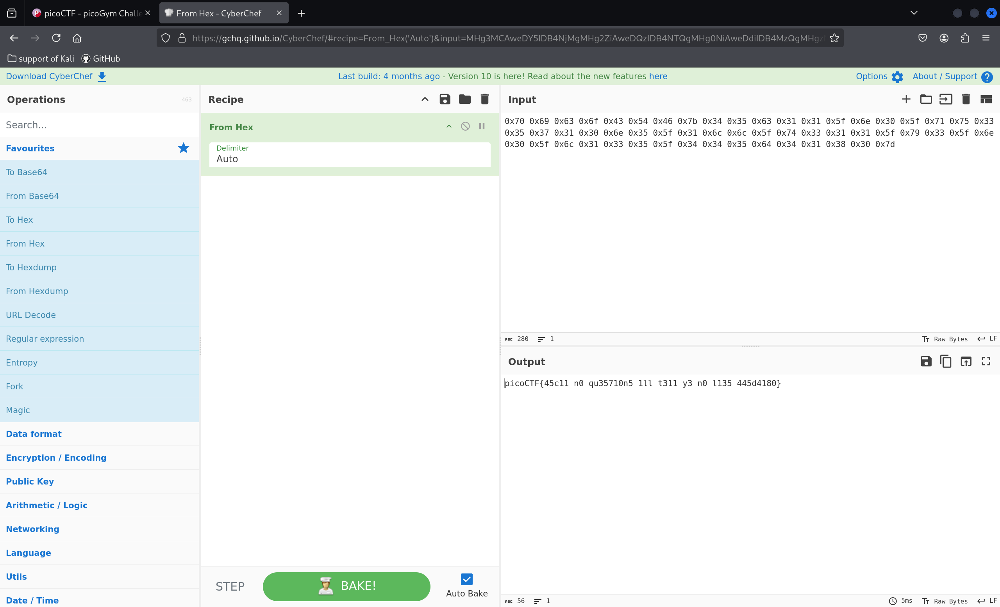
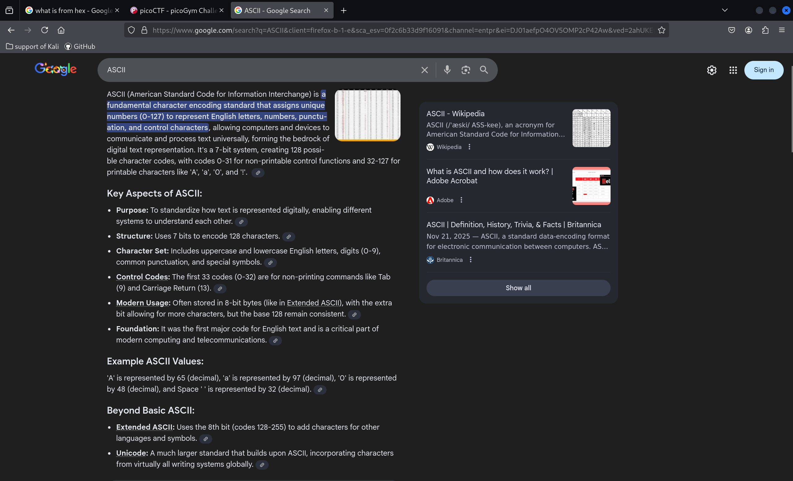

## qz form pico
 

### yoo long time no see, resons why I am not doing write up last week, thatj becuase I have to fix the phone, and that was my dad's phone so I don't have a time doing qz, I am sorry (╥﹏╥).

 

 
This was talk about ASCII numbers .
we copy the ciphertext , we use a web call **cyberchef**. 

 

we Input the ciphertext.
 

 

I try to solve the 'Permissions' question .so today question. kind a esay.

 

The Explanation of ASCII.