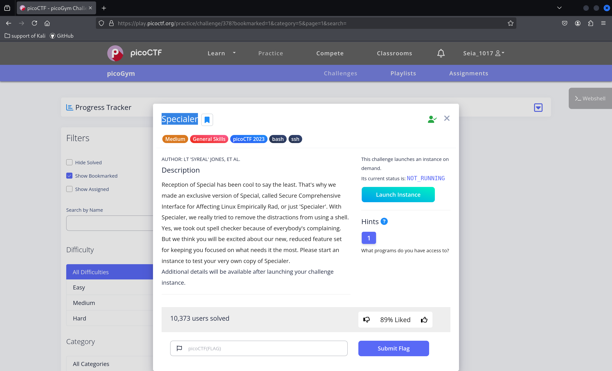
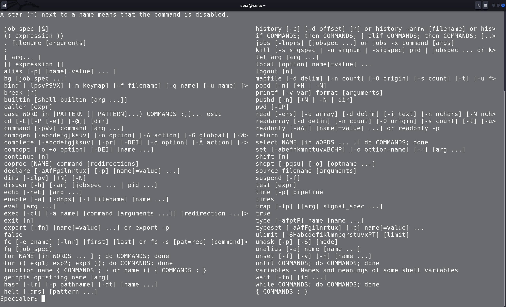
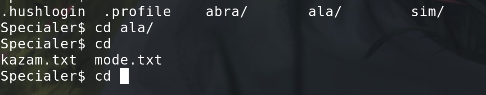
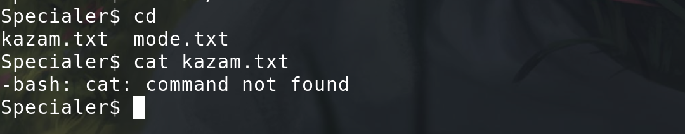
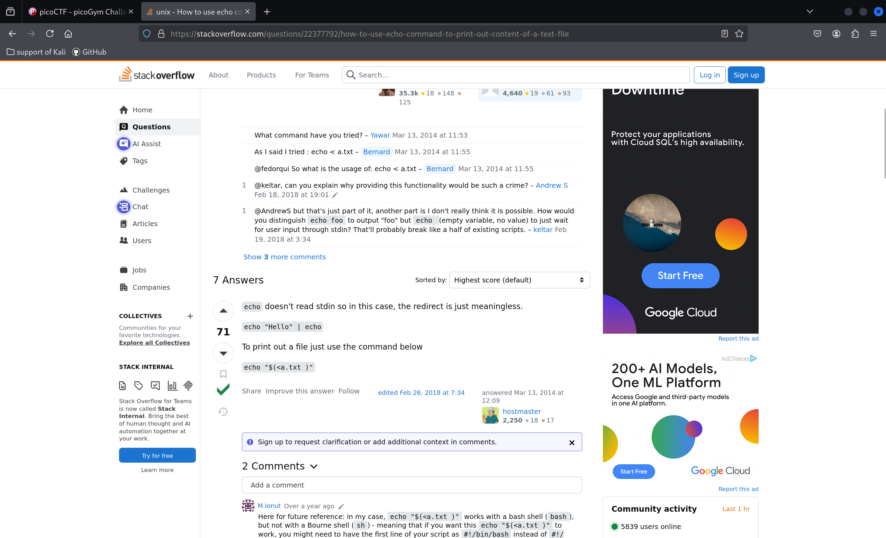
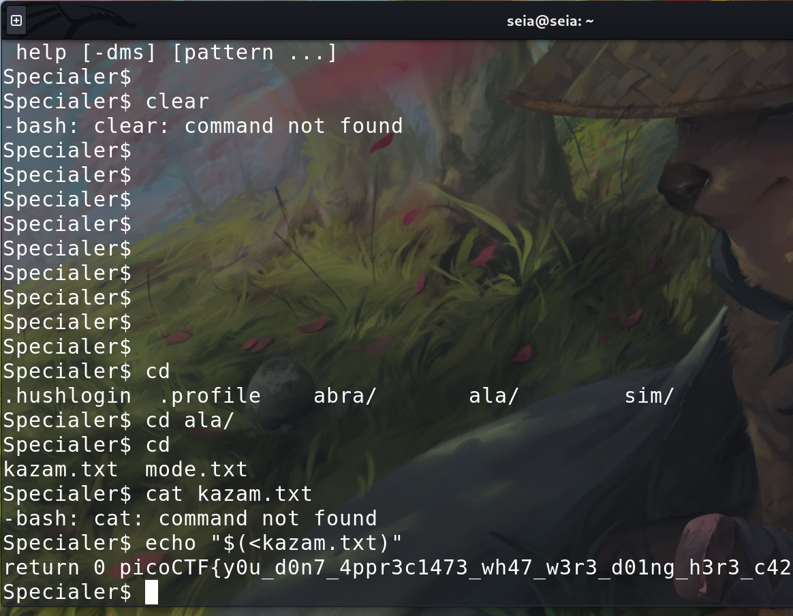

## pico 

today we doing some esay quiz. 

I try few esay command,but don't works. 

so Input the help to see what command can i use. 

we don't have the ls, but we can use the cd "" and click the tab on the keyborad. then It will show the file that we can in put  

It's txt file, but.... 

we can't use the cat in here..... 
what about the echo ? 

nice, let's try it  

let's gooooo! 
