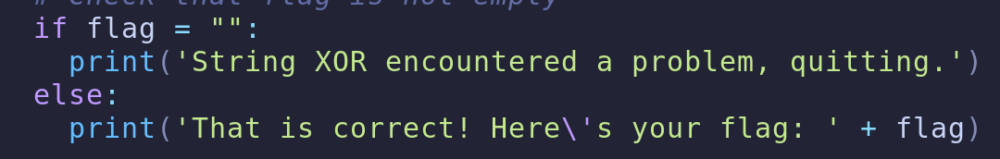
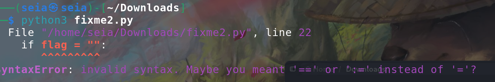

# fixme2 -- pico


<br>
## Problem Summary

This question is not hard, If you have learn the python then you can understand.<br>
So Basically I change the output part of the script. and It's work! : D <br>
## Key Observation



I go through the script and I think this part is suspicious. and final I change some and I get the flag<br>
## Exploitation Strategy
1.we look through all script:<br>
```python
import random

def str_xor(secret, key):
    #extend key to secret length
    new_key = key
    i = 0
    while len(new_key) < len(secret):
        new_key = new_key + key[i]
        i = (i + 1) % len(key)        
    return "".join([chr(ord(secret_c) ^ ord(new_key_c)) for (secret_c,new_key_c) in zip(secret,new_key)])


flag_enc = chr(0x15) + chr(0x07) + chr(0x08) + chr(0x06) + chr(0x27) + chr(0x21) + chr(0x23) + chr(0x15) + chr(0x58) + chr(0x18) + chr(0x11) + chr(0x41) + chr(0x09) + chr(0x5f) + chr(0x1f) + chr(0x10) + chr(0x3b) + chr(0x1b) + chr(0x55) + chr(0x1a) + chr(0x34) + chr(0x5d) + chr(0x51) + chr(0x40) + chr(0x54) + chr(0x09) + chr(0x05) + chr(0x04) + chr(0x57) + chr(0x1b) + chr(0x11) + chr(0x31) + chr(0x0d) + chr(0x5f) + chr(0x05) + chr(0x40) + chr(0x04) + chr(0x0b) + chr(0x0d) + chr(0x0a) + chr(0x19)

  
flag = str_xor(flag_enc, 'enkidu')

# Check that flag is not empty
if flag = "":
  print('String XOR encountered a problem, quitting.')
else:
  print('That is correct! Here\'s your flag: ' + flag) 
```
<br>

2.I saw some little problem It's the:
```python
 print('That is correct! Here\'s your flag: ' + flag) 
```
The (\') will make some problem so I del it.

3.But ...

<br>

## Root Cause
Why the vulnerability exists.

## Generalization
When this technique applies.

## Reflection
What I learned.