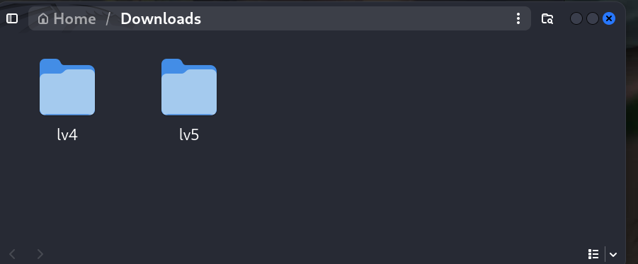
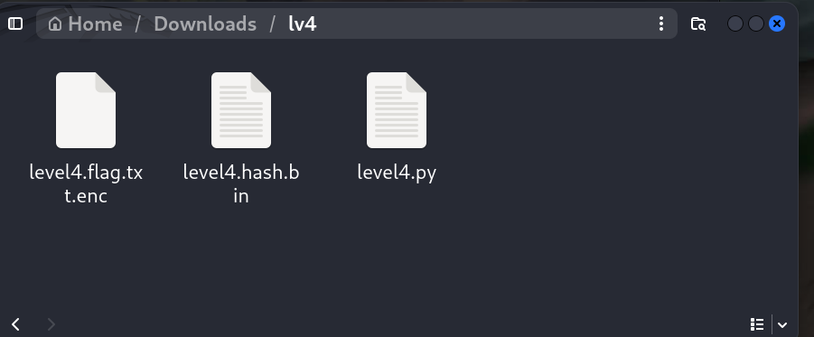
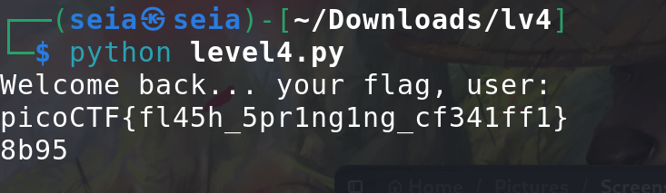

# PW-Crack4 -- form pico



<br>
## Problem Summary

This problem is more about the for loop in python, I need to read the code and do something change/ rewrite.
## Key Observation

```python
def level_4_pw_check():
    user_pw = input("Please enter correct password for flag: ")
    user_pw_hash = hash_pw(user_pw)
    
    if( user_pw_hash == correct_pw_hash ):
        print("Welcome back... your flag, user:")
        decryption = str_xor(flag_enc.decode(), user_pw)
        print(decryption)
        return
    print("That password is incorrect")
```

<br>
go thought all script we saw one things the level4_check is checking the user inputs. but we have lot passwords we need to try. so we have need other solution. 
## Exploitation Strategy
1.When I looking this code I see under the code we have a list:
```python
pos_pw_list = ["158f", "1655", "d21e", "4966", "ed69"...]
```
<br>
100 more passwords but only one is correct😱.

2.as a result, we need the for loop the solve it:
```python
def level_4_pw_check():
    for pws in pos_pw_list:

        user_pw_hash = hash_pw(pws)
    
        if( user_pw_hash == correct_pw_hash ):
            print("Welcome back... your flag, user:")
            decryption = str_xor(flag_enc.decode(), pws)
            print(decryption)
            print(pws)
```
<br>

3.

<br>
## Generalization
 we can using the for loop to run thought some question are many choose .
## Reflection
I learn how to Use the python Script