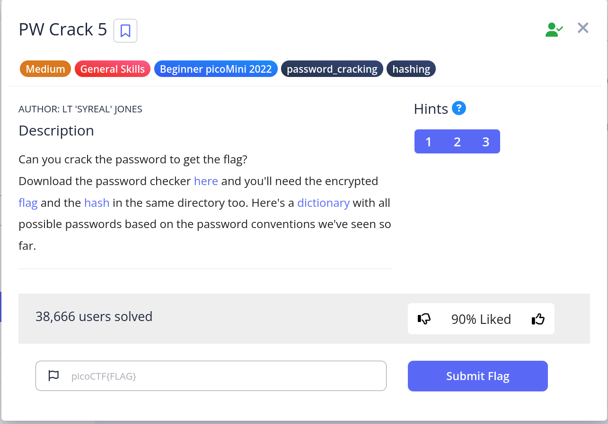
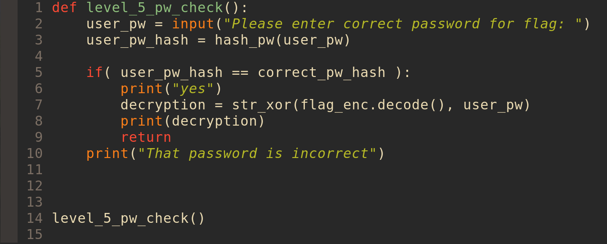
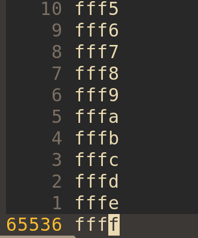
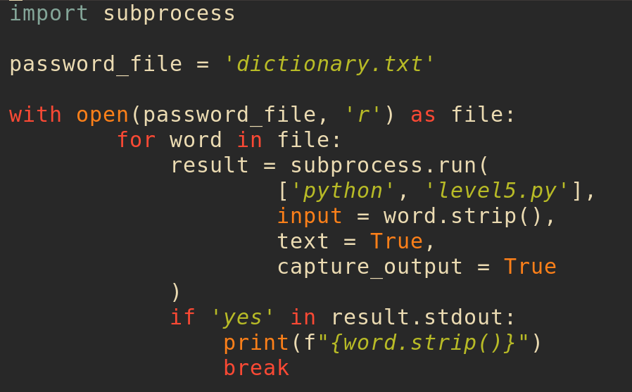
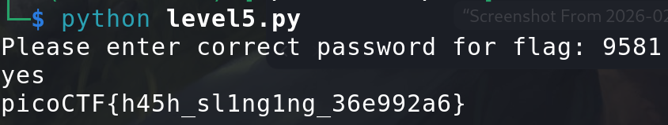

# Pw-Crack -- form pico 


<br>

## Problem Summary

This problem It was similar, like the PW-4 But we have more passwords need to try so we need new Script to go thought all password until Success.

<br>

## Key Observation

We need to use the lib in python. It's call **subprocess**
```python 
#example
import subprocess

lsProcess = subprocess.Popen(["ls"], stdout=subprocess.PIPE, text=True)
grepProcess = subprocess.Popen(
    ["grep", "sample"], stdin=ls_process.stdout,
    stdout=subprocess.PIPE, text=True)
output, error = grepProcess.communicate()

print(output)
print(error)
```
<br>

## Exploitation Strategy
1.I go check the script to make sure they are same logic.

<br>
2.It's Same logic but we have many passwords this time.

65536!😱
<br>

3.so we need a script, That we don't need to move the hug amount of passwords. and make connection with **level5.py** then we can try every password. as a result we got this:

<br>
4.and we run this:

Let's goooo!
<br>
## Generalization

I think this is really important, because this script is really practical.
and the question Let me learn some lib that I never hear. :D

