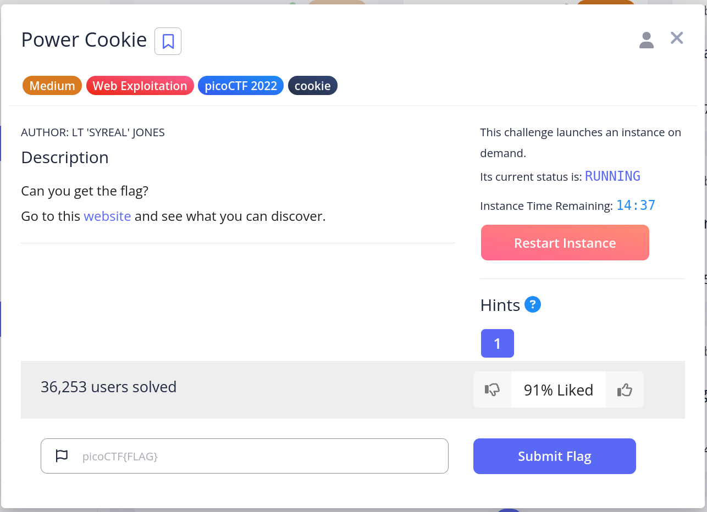
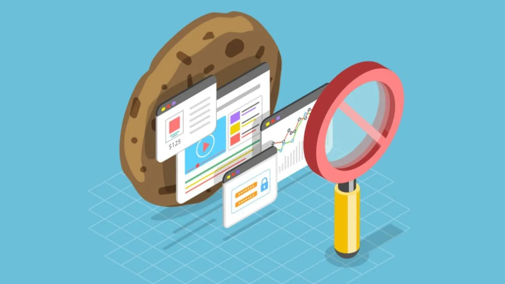
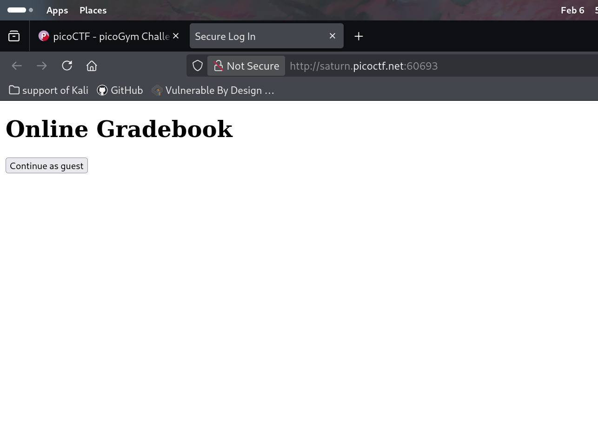
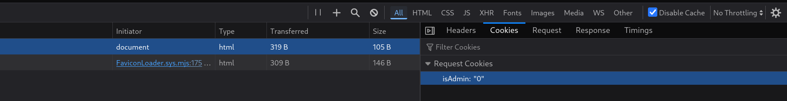
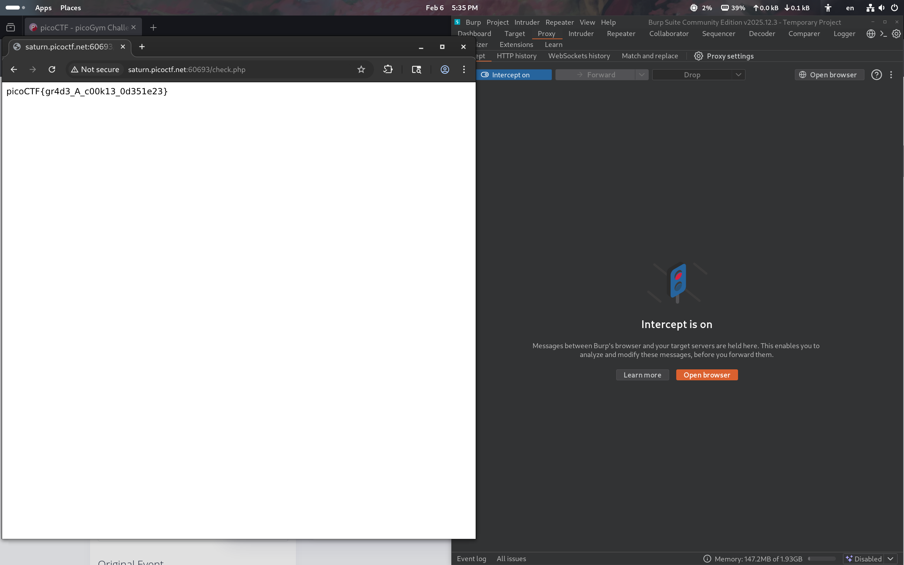

# Power Cookie -- from pico


<br>

## Problem Summary

I think this question the key point is in the cookie. We will see it.
<br>

<br>

## Key Observation

The important is we need the Burpsurite to help us change the cookie.
<br>


<br>
## Exploitation Strategy
1.
<br>
I got in the webside and I see a simple text with a button, I want to see what happen next so I click the **Continue as guest**
2.
<br>
all right ... some information we don't need. OH wait the cookie!

3.

<br>
This is really important, because we can know why we can't get the flag or other information. as a result.

4.
<br>

## Root Cause

This is the code that I believe looks like .
```js
const isAdmin = getCookie('isAdmin');

if (isAdmin === '1') {
  intoWeb();
} else {
  NotIntoWeb();
}
```
SO, I think the problem is the web didn't hide this cookie and over trust me.
## Generalization
Summary,  we can't NOT to write some important information under using cookie to protection.
<br>
and this is one solution that I think is work well.
<br>
1. Retrieve sessionId / userId from the cookie
2. The server uses it to identify the actual user
3. Read isAdmin / role from the database
4. Then decide: allow access or reject
<br>

## Reflection
What I learned the true plan for the webside.

