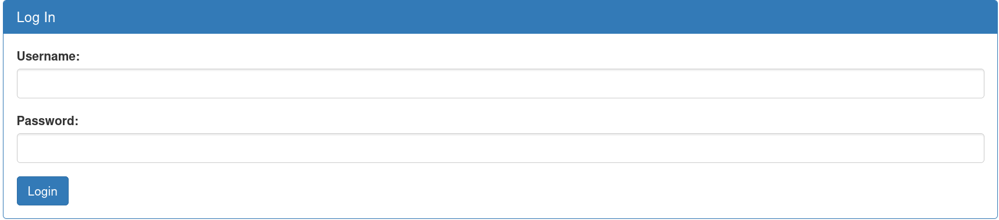
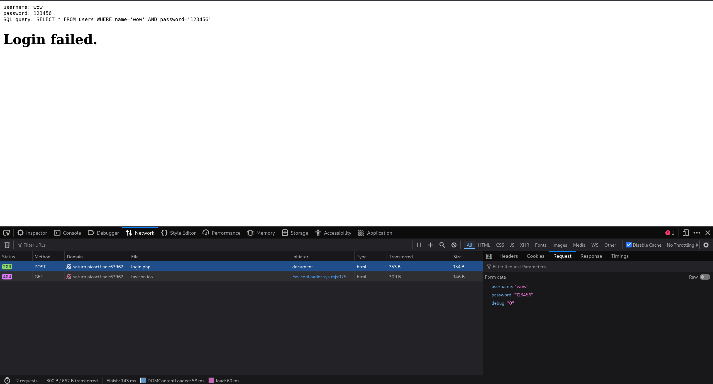

# SQLiLite -- form pico

## Problem Summary

Form the title we know This is about mySQl question. In this case I'll try the classic injection idea.

<br>
## Key Observation
I notices the hints said admin is our target! So that was important. We will use it latter.

## Exploitation Strategy
1.I click in to the web side, I saw two bar,  use for input the user name and password.

<br>
2.Before we injection I want to see what happen if I input wrong stuff.

<br>
3.It's like what i think.  and now I'll try to **'lite to server'**

<br>
It's works! 
## Root Cause

```php
<?php
// user input
$username = "admin";
$password = "' OR 1=1 -- ";

// DANGER code!!
$sql = "SELECT * FROM users 
        WHERE username = '$username' 
        AND password = '$password'";

echo $sql;
?>
```
<br>
I think the webside using same idea(danger!). The attacker will input danger word to injection!
```php
AND password = 'or 1=1 --' true_password //the True password is failed!
```
<br>
This problme happening, that because the program thought this is right script. and just run it :(
## Generalization

This is classic problem in the mySQL, I think this is really interesting. You can use logic to brake the logic!
for fixing:
```php
$stmt = $conn->prepare(
    "SELECT * FROM users WHERE username = ? AND password = ?"
);

$stmt->bind_param("ss", $username, $password);
$stmt->execute();
$result = $stmt->get_result();
```
This idea was before user input we add one more ''.<br>
This will comment out the rest of the attack payload.

```php
//start 
$password = ? // add ''

// attack input 
$password -> 'or 1=1 --'

// final
$password -> '''or 1=1--' // String
```
