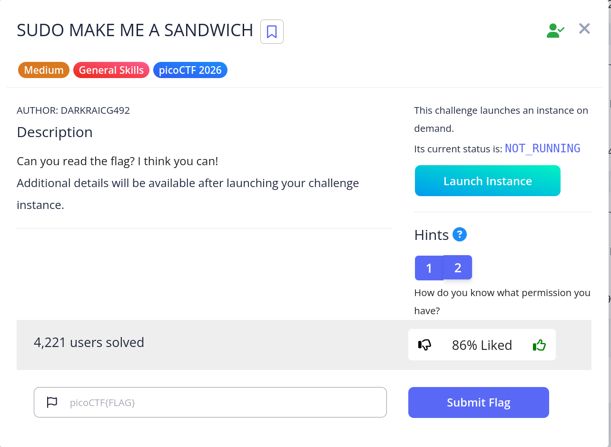
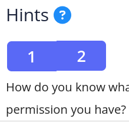
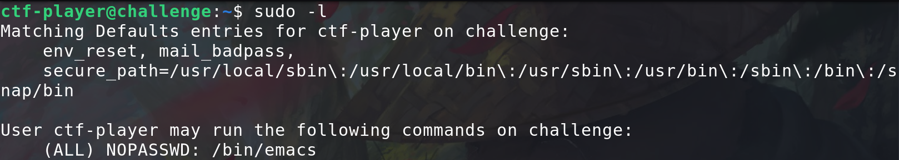
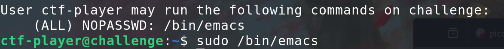
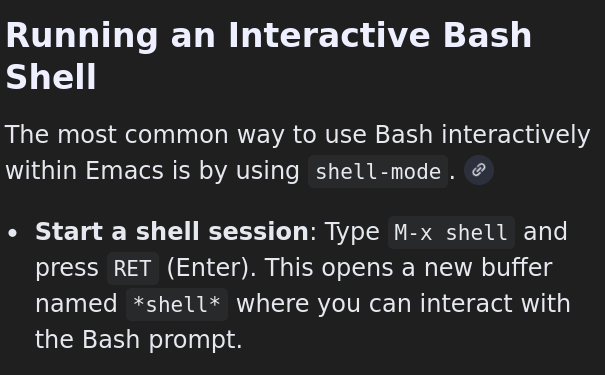
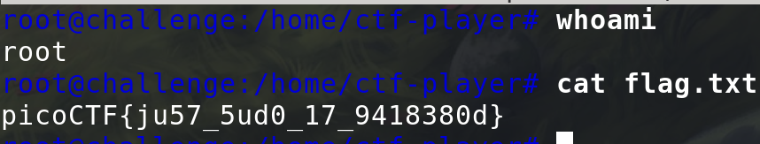

# sudo make a sandwich - pico


## Problem Summary

This question is using the emacs to get the permissions

<br>
## Key Observation

```bash
sudo -l
```
This command will allow you to see which program have permissions.
## Exploitation Strategy
1.

When I see this Hint I guess we need to get the permissions from some program already have root.

2.
Now I know the emacs have the permissions. Let's open it.

3.
<br>
When I open the emacs I realize I don't know how to open the shell in here. Google is practical.



Let's gooo
## Reflection
I learned the emacs and know how to open the shell and get the permissions.
