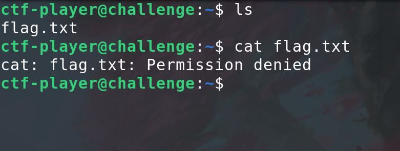
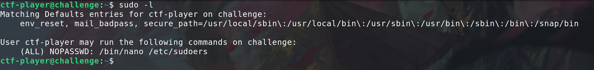
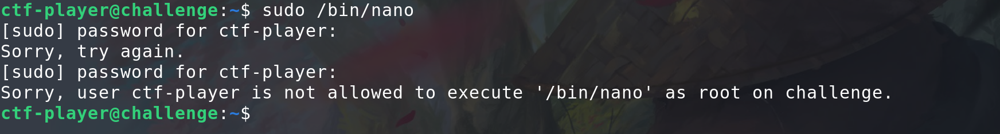
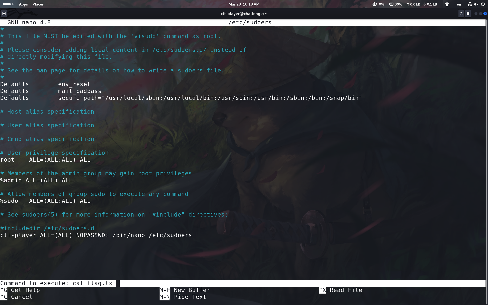
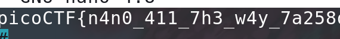

# sudo nano


<br>
## Problem Summary

This problem was similar like the **[sudo-make-sandwich](../3-21/sandwich.md)**
But we have to use nano to be our open the door's key.
## Key Observation

**GNU nano** (or simply **nano**) is a simple, user-friendly, command-line text editor for Linux and other Unix-like operating systems.
## Exploitation Strategy
1.
We have to found the root.
<br>
2.

Looks we can not just run nano.
3.
```bash
sudo /bin/nano /etc/sudoers
```

nice we get into it. Let's using cat

<br>
## Reflection
I learn how to execute in nano.
