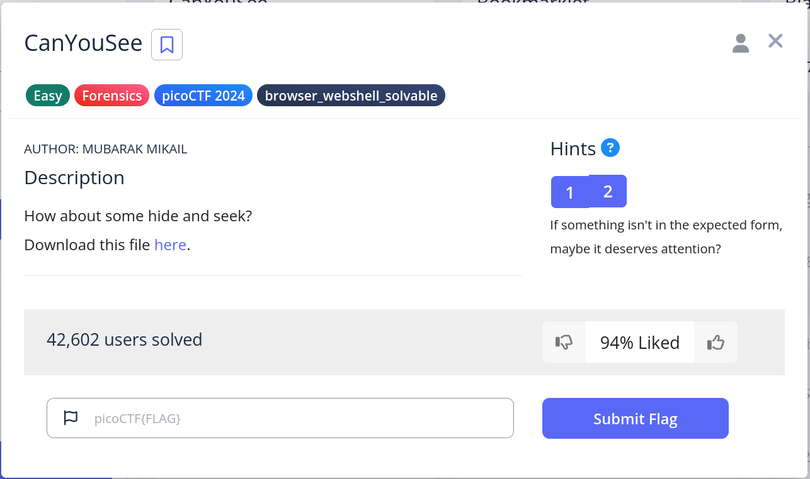
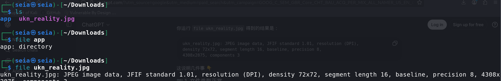
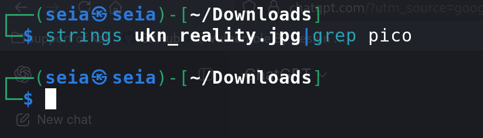
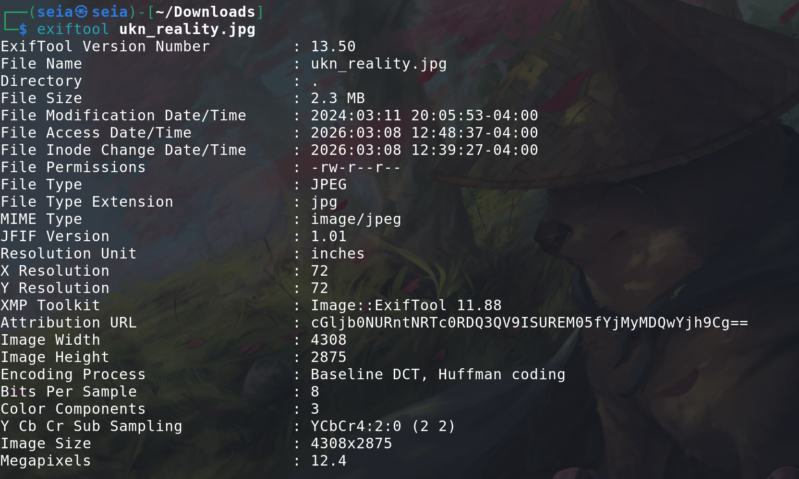
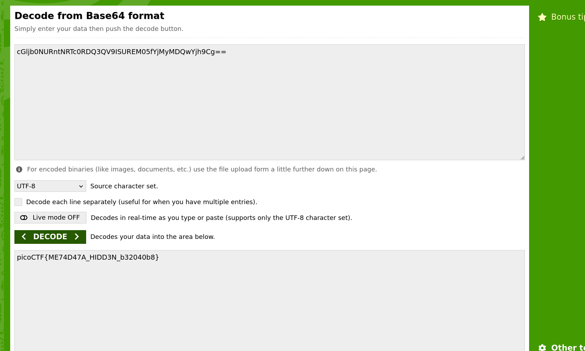

# CanyouSee -- from pico 

 
## Problem Summary

This is funny question a picture hiding the important information. We will using **exiftool**  to help use to found the flag.

## Exploitation Strategy
1.We download the picture:

 

2.Look like it's just a normal picture. But I don't think is that esay. So first I check the file to see What type of picture.

 
3.emm... looks nothing. Let's try string.:

 
4.nothing again! :P . now We need the **exiftool**.  
(The  **exiftool** is a free, open-source, cross-platform command-line application and Perl library developed by Phil Harvey, designed for reading, writing, and manipulating image, video, and PDF metadata)

5.
 
somethings looks SUS. Let's see the **Attribution URL** . it's should be is long link but. it's not, That look like base64 code. now go to decode.

6.
 
let's gooooo!
## Reflection
I learn the **exiftool** and picture hiding text.