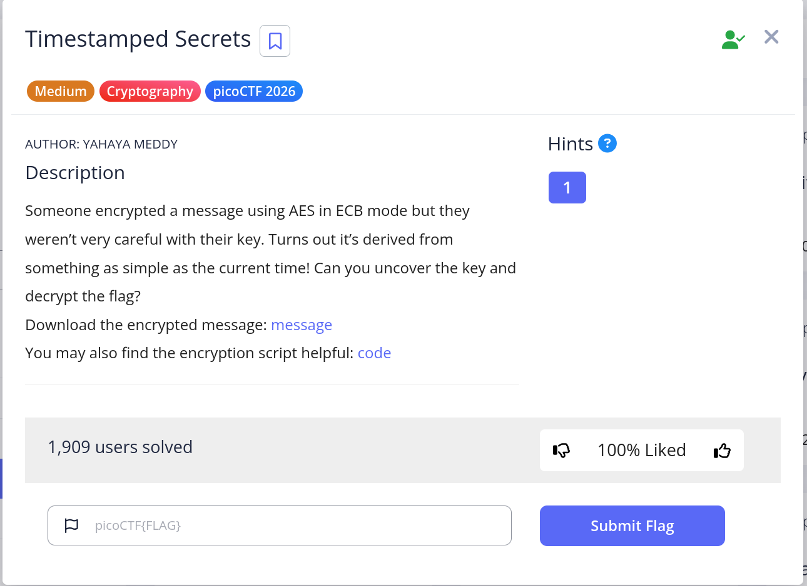
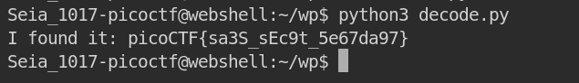
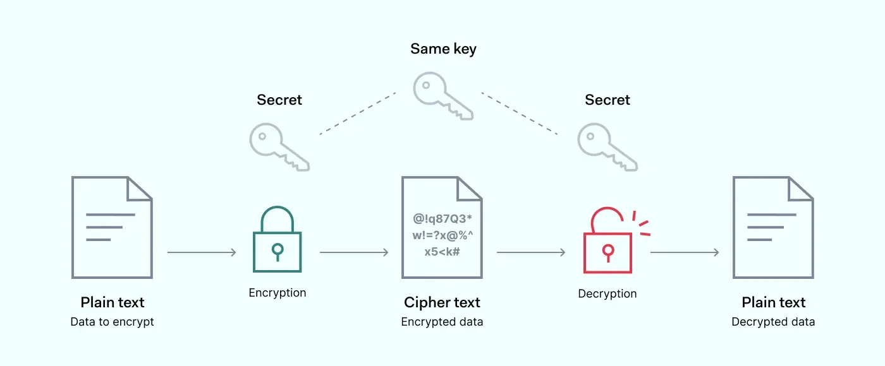

# TimeStamp -- form pico


<br>
## Problem Summary

This problem is about Cryptography We have to learn about the **AES** how it work.  and I will talk about it in the bottom
## Key Observation

WE need the time stamp to know what is the key so the message.txt is important here is the information:<br>
```txt
Hint: The encryption was done around 1770242624 UTC
Ciphertext (hex): dcc2a6a4cf3dbc69a929aa7c4e3c33e7558eef1f2244bde76e450b065188db38
```
## Exploitation Strategy
1.We open the script and see how it encode!<br>
```python
from hashlib import sha256
import time
from Crypto.Cipher import AES
from Crypto.Util.Padding import pad

def encrypt(plaintext: str, timestamp: int) -> str:
    timestamp = int(time.time())
    key = sha256(str(timestamp).encode()).digest()[:16]
    cipher = AES.new(key, AES.MODE_ECB)
    padded = pad(plaintext.encode(), AES.block_size)
    ciphertext = cipher.encrypt(padded)
    return ciphertext.hex()

if __name__ == "__main__":
  
    plaintext = "picoCTF{...}"
    result = encrypt(plaintext, key)
    print(f"Hint: The encryption was done around {timestamp} UTC\n")
    print(f"Ciphertext (hex): {ciphertext.hex()}\n")
```
2.now we need to target the keywords!
```python
 timestamp = int(time.time())
 # WE already have the time so we don't need this
 
 key = sha256(str(timestamp).encode()).digest()[:16]
 # IT tells us how to make the key 
 # Use sha256 to encode **timestamp** and only get 16 letter.
 
 cipher = AES.new(key, AES.MODE_ECB)
 # THE cipher is made by KEY and AES.MODE_ECB.
 
 ciphertext = cipher.encrypt(padded)
 # binary to str
 
```
3.This is we i write: (I will tell how to decode. It's in the **Root cause**)
```python
from Crypto.Util.Padding import unpad  
from Crypto.Cipher import AES  
from hashlib import sha256  
  
UTC_time = 1770242624  
cipher_text_hex = 'dcc2a6a4cf3dbc69a929aa7c4e3c33e7558eef1f2244bde76e450b065188db38'  
cipher_text_bytes = bytes.fromhex(cipher_text_hex)  
targetTime_range = 500  
  
ISfound = False  
for t in range(UTC_time - targetTime_range, UTC_time + targetTime_range + 1):  
    keys = sha256(str(t).encode()).digest()[:16]  
    try:  
        cipher = AES.new(keys, AES.MODE_ECB)  
        decrypted = cipher.decrypt(cipher_text_bytes)  
        plaintext = unpad(decrypted, AES.block_size)  
  
        if b"pico" in plaintext:  
            print(f"I found it: {plaintext.decode()}")  
            ISfound = True  
            break  
    except (ValueError, KeyError):  
        continue  
  
if not ISfound:  
    print("Not found, try increasing the range.")
```


owo
## Root Cause
**"AES (Advanced Encryption Standard) is the global standard for symmetric encryption. It uses the same key to lock and unlock data in fixed 128-bit blocks, making it both fast and highly secure."** <br>

<br>
note: It's use binary to encode so When we get the hex (dcc2a6a4cf3dbc69a929aa7c4e3c33e7558eef1f2244bde76e450b065188db38) we have to change to binary <br>
```python
cipher_text_bytes = bytes.fromhex(cipher_text_hex) 
```
WE know the time stamp is important, but we don't know the  **Exact Time** so we have to try for different btw **1770242624** I set:
```python
targetTime_range = 500 # means time btw; 500 <- 1770242624 -> 500
```
 so my keys are btw the 1000 numbers.  I use sha256 to encode and cut for 16.
We have to try many time for get the true answer we using python try.

```python
try:  
    cipher = AES.new(keys, AES.MODE_ECB)  
	 #ECB mode splits plaintext into fixed 16-byte blocks and encrypts each one(using the key)
    
	decrypted = cipher.decrypt(cipher_text_bytes)  
	#decoding !
	
    plaintext = unpad(decrypted, AES.block_size)  
	# unpad means remove the AES's block that was adding in to the plaintext
```

<br>
After this we using if to check have we get the correct answer.

## Reflection
I learn the AES.