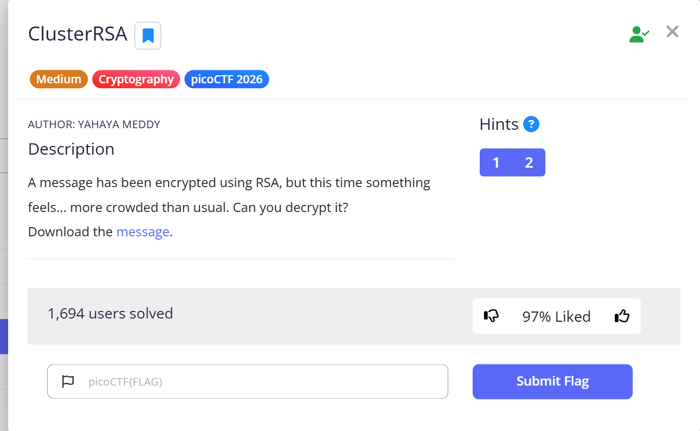
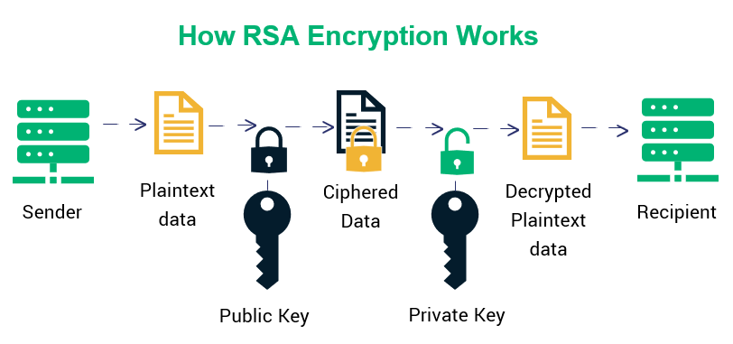
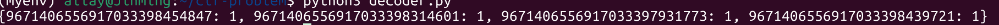

# ClusterRSA - form pico


## Problem Summary

This problem is challenging, But when you understand it you will know how to do : D <br>
In the title *ClusterRSA*, **Cluster** is important words and hints
In the problem we need to get the private key to get the plain text 

```python
# THis is a example of RSA
#!/usr/bin/env python3
# Prime number
p = 5
q = 3

# prime number multiply together
N = p*q

# using Euler's function
T = (p - 1)*(q - 1)
print(T)

#choose public key
e = 3

#choose private key
d = 7

text = 6

def RAS_encode(plain_text, public_key, N):
    cipher_text = (plain_text ** public_key) % N
    return cipher_text

def RAS_decode(cipher_text, private_key, N):
    plain_text = (cipher_text ** private_key) % N
    return plain_text

ciphertext = RAS_encode(text, e, N)
plaintext  = RAS_decode(ciphertext, d, N)

print(ciphertext)
print(plaintext)
```
## Key Observation
we need a script to get multi-prime number
```python
import sympy
factors = sympy.factorint(n) # n is the all prime number multiply together.
print(factors)
```

## Exploitation Strategy
1.When we open the message.txt it give some information that we need:<br>
```txt
n = 874900289913204769... # n is the all prime number multiply together.
e = 65537 # e means public key
ct = 2630159242114455... # ct is cipher-text
```
<br>
2.if you know how RSA work you will know the prime is important because the can use the numbers to get value **phi** and **N**. we will use this problem to get the flag.
```python
import sympy
factors = sympy.factorint(n) # n is the all prime number multiply together.
print(factors)
```

<br>
3.after calculation we got 4 different prime number. then we need get the value **phi**.<br>
**phi = (p1-1)(p2-1)(p3-1)(p4-1)** and private key **d = pow(e, -1, phi)** (this is the fast way to get the key)

4.when we get the private key we can decode the ciphertext.
```python
def RASdecode(cipher_text, private_key, N):
    plain_text = pow(cipher_text, private_key, N)
    return plain_text
```
But when we get the plaintext it's a long number. That because the plaintext need to use ACSII code or Unicode. This time we try ACSII.
```python
h = hex(plaintext)[2:]
if len(h) % 2: # ACSII always two digits
    h = '0' + h

plaintext = bytes.fromhex(h)
print(plaintext.decode())
```
The we got the flag: picoCTF{mul71_rsa_8c9...}
## Root Cause
“φ(n) represents the number of integers from 1 to n that are coprime with n.”
that is why we write **phi = (p1-1)(p2-1)(p3-1)(p4-1)**

e⋅d≡1(modφ(n))
 **d = pow(e, -1, phi)**

Reason why we can decode it.
Two large prime numbers = two extremely complex locks
Four small prime numbers = four relatively simple locks

## Reflection
What I learned RSA. how to build it.
full code:
```python
n = 874900289913205717156720453193651...
e = 65537
ct = 2630159242114455882250725003742546116295910618429...
p1 = 9671406556917033398454847
p2 = 9671406556917033398314601
p3 = 9671406556917033397931773
p4 = 9671406556917033398439721
phi = (p1-1)*(p2-1)*(p3-1)*(p4-1)

def RASdecode(cipher_text, private_key, N):
    plain_text = pow(cipher_text, private_key, N)
    return plain_text

d = pow(e, -1, phi)

plaintext = RASdecode(ct, d, n)

h = hex(plaintext)[2:]
if len(h) % 2:
    h = '0' + h

plaintext = bytes.fromhex(h)

print(plaintext)
print(plaintext.decode())

'''
factors = sympy.factorint(n)
print(factors)
'''

```
   