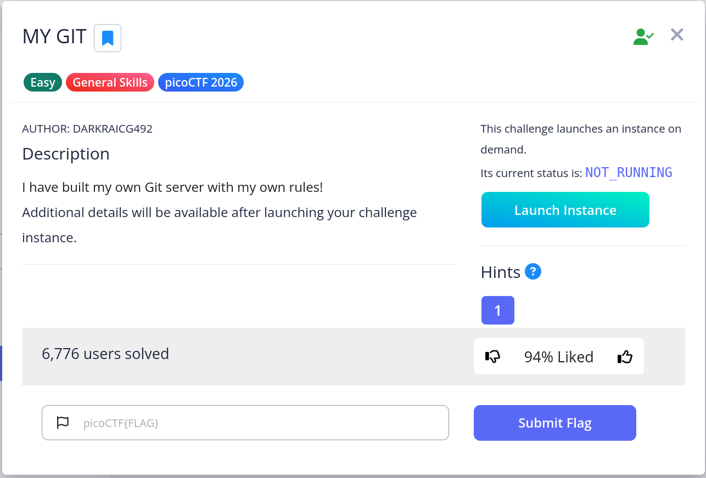
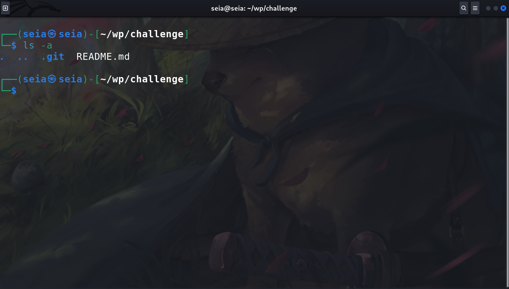
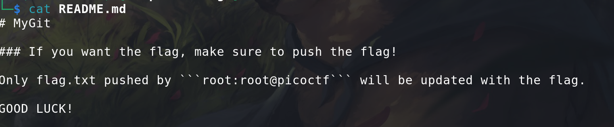
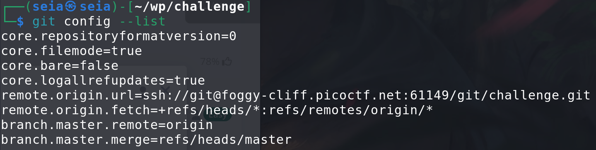
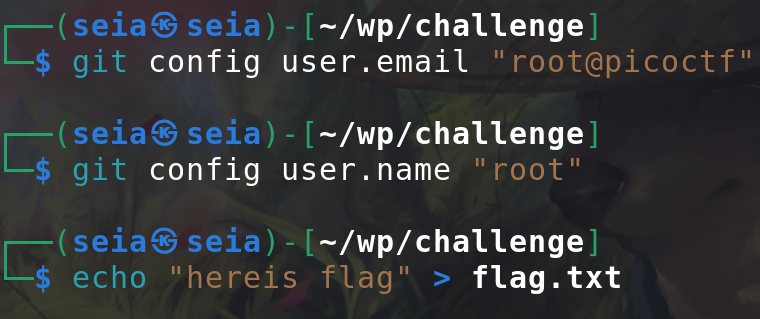
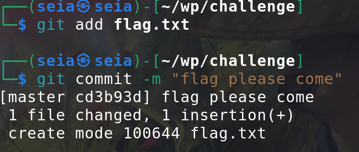
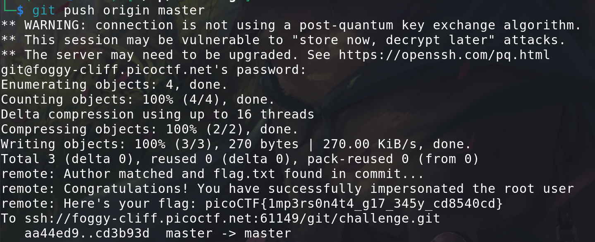

# mygit

 
## Problem Summary
Today I will try try the problem about the git. So this problem may need some git skill. and just do it!

 
## Key Observation
There is the hint:

## Exploitation Strategy
1.Now we know we have to change out user-name and user-email. and make file call : **flag.txt**. Before we doing this I will use **git --config** to see do what config already have.

 
2.cool, we know It's branch is master. So let's start config the account:

 
3.and push it!:

let's gooo!  
## Reflection
What I learned some git.
